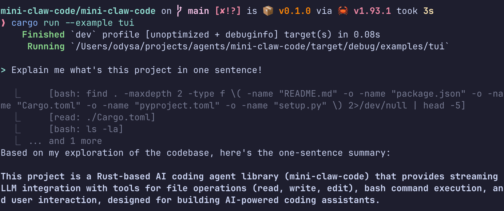
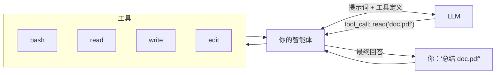
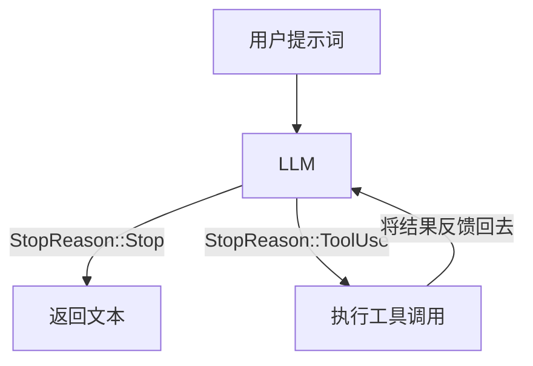

<h1 align="center">Mini Claw Code</h1>

<p align="center">
  <strong>用 Rust 从零构建你自己的编程智能体。</strong><br>
  Claude Code、Cursor、OpenCode 背后的核心架构 —— 用约 300 行代码揭秘。
</p>

<p align="center">
  <a href="https://odysa.github.io/mini-claw-code/">阅读教程</a> &middot;
  <a href="#快速开始">快速开始</a> &middot;
  <a href="#章节路线图">章节目录</a>
</p>

<p align="center">
  <a href="README.md">English</a> | 中文
</p>

---

你每天都在使用编程智能体，但你有没有想过它们到底是怎么工作的？

<p align="center">
  
</p>

比你想象的要简单。去掉 UI、流式传输、模型路由——每个编程智能体的核心就是这个循环：

```
loop:
    response = llm(messages, tools)
    if response.done:
        break
    for call in response.tool_calls:
        result = execute(call)
        messages.append(result)
```

LLM 永远不会直接操作你的文件系统。它*请求*你的代码执行工具——读文件、运行命令、编辑代码——而你的代码*执行*。这个循环就是全部核心思想。

本教程从零构建这个循环。**15 章。测试驱动。没有黑魔法。**



## 你将构建什么

一个能够实际工作的编程智能体：

- **运行 Shell 命令** —— `ls`、`grep`、`git`，任何命令
- **读写文件** —— 完整的文件系统访问
- **编辑代码** —— 精确的查找替换
- **对接真实 LLM** —— 通过 OpenRouter（有免费额度，无需信用卡）
- **流式响应** —— SSE 解析，逐 token 输出
- **主动提问** —— 任务执行中向用户请求澄清
- **先规划后执行** —— 只读规划模式，需审批后才执行

全程测试驱动。第 6 章之前不需要 API Key——即使到了第 6 章，默认模型也是免费的。

## 核心循环

每个编程智能体——包括你将要构建的——都基于这个循环运行：



对 `StopReason` 进行模式匹配，按指令执行。这就是全部架构。

## 章节路线图

**第一部分 —— 亲手构建**（动手实践，测试驱动）

| 章 | 你要构建 | 核心领悟 |
|----|---------|---------|
| 1 | `MockProvider` | 协议：消息输入，工具调用输出 |
| 2 | `ReadTool` | `Tool` trait —— 每个工具都是这个模式 |
| 3 | `single_turn()` | 对 `StopReason` 模式匹配 —— LLM 告诉你该做什么 |
| 4 | Bash, Write, Edit | 重复练习，巩固理解 |
| 5 | `SimpleAgent` | 循环 —— 将 single_turn 扩展为真正的智能体 |
| 6 | `OpenRouterProvider` | HTTP 调用真实 LLM（OpenAI 兼容 API）|
| 7 | CLI 聊天应用 | 用约 15 行代码将所有组件串联起来 |

**第二部分 —— 奇点时刻**（你的智能体开始自己写代码了）

| 章 | 主题 | 新增能力 |
|----|------|---------|
| 8 | 奇点时刻 | 你的智能体可以编辑自己的源代码 |
| 9 | 更好的 TUI | Markdown 渲染、加载动画、折叠的工具调用 |
| 10 | 流式传输 | 带有 SSE 解析和 `AgentEvent` 的 `StreamingAgent` |
| 11 | 用户输入 | `AskTool` —— 让 LLM 向*你*提问 |
| 12 | 规划模式 | 只读规划，审批后执行 |
| 13 | 子智能体 | *即将推出* |
| 14 | MCP | *即将推出* |
| 15 | 安全护栏 | *即将推出* |


## 快速开始

```bash
git clone https://github.com/odysa/mini-claw-code.git
cd mini-claw-code
cargo build
```

启动教程：

```bash
cargo install mdbook mdbook-mermaid   # 仅需安装一次
cargo x book                          # 在 localhost:3000 打开
```

或在线阅读：**[odysa.github.io/mini-claw-code](https://odysa.github.io/mini-claw-code/)**。

## 学习流程

每一章都遵循相同的节奏：

1. **阅读**该章内容
2. **打开** `mini-claw-code-starter/src/` 中对应的文件
3. **替换** `unimplemented!()` 为你的代码
4. **运行** `cargo test -p mini-claw-code-starter chN`

测试通过 = 你搞定了。

## 项目结构

```
mini-claw-code-starter/     <- 你的代码（填写桩函数）
mini-claw-code/             <- 参考实现（别偷看！）
mini-claw-code-book/        <- 教程（15 章）
mini-claw-code-xtask/       <- 辅助命令（cargo x ...）
```

## 前置要求

- **Rust 1.85+** —— [rustup.rs](https://rustup.rs)
- 基础 Rust 知识（所有权、枚举、`Result`/`Option`）
- 第 6 章之前不需要 API Key

## 常用命令

```bash
cargo test -p mini-claw-code-starter ch1    # 测试单个章节
cargo test -p mini-claw-code-starter        # 测试全部
cargo x check                               # 格式检查 + clippy + 测试
cargo x book                                # 启动教程
```

## 许可证

MIT
