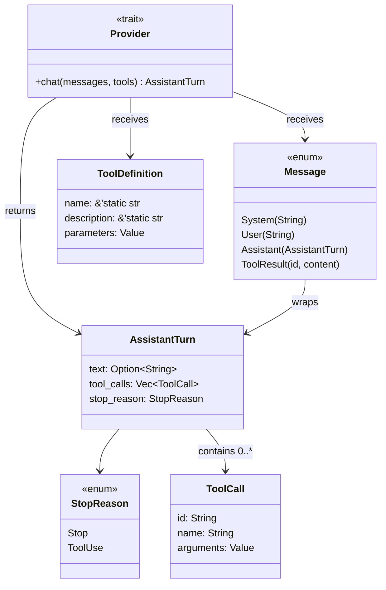
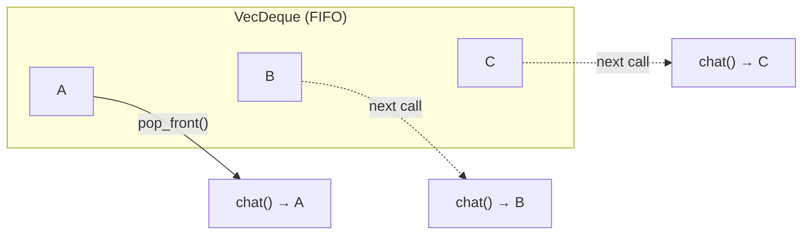

# Chapter 1: Core Types

In this chapter you will understand the types that make up the agent protocol --
`StopReason`, `AssistantTurn`, `Message`, and the `Provider` trait. These are
the building blocks everything else is built on.

To verify your understanding, you will implement a small test helper:
`MockProvider`, a struct that returns pre-configured responses so that you can
test future chapters without an API key.

## Goal

Understand the core types, then implement `MockProvider` so that:

1. You create it with a `VecDeque<AssistantTurn>` of canned responses.
2. Each call to `chat()` returns the next response in sequence.
3. If all responses have been consumed, it returns an error.

## The core types

Open `mini-claw-code-starter/src/types.rs`. These types define the protocol
between the agent and any LLM backend.

Here is how they relate to each other:



`Provider` takes in messages and tool definitions, and returns an
`AssistantTurn`. The turn's `stop_reason` tells you what to do next.

### `ToolDefinition` and its builder

```rust
pub struct ToolDefinition {
    pub name: &'static str,
    pub description: &'static str,
    pub parameters: Value,
}
```

Each tool declares a `ToolDefinition` that tells the LLM what it can do. The
`parameters` field is a JSON Schema object describing the tool's arguments.

Rather than building JSON by hand every time, `ToolDefinition` has a builder
API:

```rust
ToolDefinition::new("read", "Read the contents of a file.")
    .param("path", "string", "The file path to read", true)
```

- `new(name, description)` creates a definition with an empty parameter schema.
- `param(name, type, description, required)` adds a parameter and returns
  `self`, so you can chain calls.

You will use this builder in every tool starting from Chapter 2.

### `StopReason` and `AssistantTurn`

```rust
pub enum StopReason {
    Stop,
    ToolUse,
}

pub struct AssistantTurn {
    pub text: Option<String>,
    pub tool_calls: Vec<ToolCall>,
    pub stop_reason: StopReason,
}
```

The `ToolCall` struct holds a single tool invocation:

```rust
pub struct ToolCall {
    pub id: String,
    pub name: String,
    pub arguments: Value,
}
```

Each tool call has an `id` (for matching results back to requests), a `name`
(which tool to call), and `arguments` (a JSON value the tool will parse).

Every response from the LLM comes with a `stop_reason` that tells you *why*
the model stopped generating:

- **`StopReason::Stop`** -- the model is done. Check `text` for the response.
- **`StopReason::ToolUse`** -- the model wants to call tools. Check `tool_calls`.

This is the raw LLM protocol: the model tells you what to do next. In
Chapter 3 you will write a function that explicitly `match`es on
`stop_reason` to handle each case. In Chapter 5 you will wrap that match
inside a loop to create the full agent.

### The `Provider` trait

```rust
pub trait Provider: Send + Sync {
    fn chat<'a>(
        &'a self,
        messages: &'a [Message],
        tools: &'a [&'a ToolDefinition],
    ) -> impl Future<Output = anyhow::Result<AssistantTurn>> + Send + 'a;
}
```

This says: "A Provider is something that can take a slice of messages and a
slice of tool definitions, and asynchronously return an `AssistantTurn`."

The `Send + Sync` bounds mean the provider must be safe to share across
threads. This is important because `tokio` (the async runtime) may move tasks
between threads.

Notice that `chat()` takes `&self`, not `&mut self`. The real provider
(`OpenRouterProvider`) does not need mutation -- it just fires HTTP requests.
Making the trait `&mut self` would force every caller to hold exclusive access,
which is unnecessarily restrictive. The trade-off: `MockProvider` (a test
helper) *does* need to mutate its response list, so it must use interior
mutability to conform to the trait.

### The `Message` enum

```rust
pub enum Message {
    System(String),
    User(String),
    Assistant(AssistantTurn),
    ToolResult { id: String, content: String },
}
```

The conversation history is a list of `Message` values:

- **`System(text)`** -- a system prompt that sets the agent's role and behavior.
  Typically the first message in the history.
- **`User(text)`** -- a prompt from the user.
- **`Assistant(turn)`** -- a response from the LLM (text, tool calls, or both).
- **`ToolResult { id, content }`** -- the result of executing a tool call. The
  `id` matches the `ToolCall::id` so the LLM knows which call this result
  belongs to.

You will use these variants starting in Chapter 3 when building the
`single_turn()` function.

### Why `Provider` uses `impl Future` but `Tool` uses `#[async_trait]`

You may notice in Chapter 2 that the `Tool` trait uses `#[async_trait]` while
`Provider` uses `impl Future` directly. The difference is about how the trait
is used:

- **`Provider`** is used *generically* (`SimpleAgent<P: Provider>`). The
  compiler knows the concrete type at compile time, so `impl Future` works.
- **`Tool`** is stored as a *trait object* (`Box<dyn Tool>`) in a collection of
  different tool types. Trait objects require a uniform return type, which
  `#[async_trait]` provides by boxing the future.

When implementing a trait that uses `impl Future`, you can simply write
`async fn` in the `impl` block -- Rust desugars it to the `impl Future` form
automatically. So while the trait *definition* says `-> impl Future<...>`,
your *implementation* can just write `async fn chat(...)`.

If this distinction is unclear now, it will click in Chapter 5 when you see
both patterns in action.

### `ToolSet` -- a collection of tools

One more type you will use starting in Chapter 3: `ToolSet`. It wraps a
`HashMap<String, Box<dyn Tool>>` and indexes tools by name, giving O(1)
lookup when executing tool calls. You build one with a builder:

```rust
let tools = ToolSet::new()
    .with(ReadTool::new())
    .with(BashTool::new());
```

You do not need to implement `ToolSet` -- it is provided in `types.rs`.

## Implementing `MockProvider`

Now that you understand the types, let's put them to use. `MockProvider` is a
test helper -- it implements `Provider` by returning canned responses instead of
calling a real LLM. You will use it throughout chapters 2--5 to test tools and
the agent loop without needing an API key.

Open `mini-claw-code-starter/src/mock.rs`. You will see the struct and method
signatures already laid out with `unimplemented!()` bodies.

### Interior mutability with `Mutex`

`MockProvider` needs to *remove* responses from a list each time `chat()`
is called. But `chat()` takes `&self`. How do we mutate through a shared
reference?

Rust's `std::sync::Mutex` provides interior mutability: you wrap a value in a
`Mutex`, and calling `.lock().unwrap()` gives you a mutable guard even through
`&self`. The lock ensures only one thread accesses the data at a time.

```rust
use std::collections::VecDeque;
use std::sync::Mutex;

struct MyState {
    items: Mutex<VecDeque<String>>,
}

impl MyState {
    fn take_one(&self) -> Option<String> {
        self.items.lock().unwrap().pop_front()
    }
}
```

### Step 1: The struct fields

The struct already has the field you need: a `Mutex<VecDeque<AssistantTurn>>`
to hold the responses. This is provided so that the method signatures compile.
Your job is to implement the methods that use this field.

### Step 2: Implement `new()`

The `new()` method receives a `VecDeque<AssistantTurn>`. We want FIFO order --
each call to `chat()` should return the *first* remaining response, not the
last. `VecDeque::pop_front()` does exactly that in O(1):



So in `new()`:
1. Wrap the input deque in a `Mutex`.
2. Store it in `Self`.

### Step 3: Implement `chat()`

The `chat()` method should:
1. Lock the mutex.
2. `pop_front()` the next response.
3. If there is one, return `Ok(response)`.
4. If the deque is empty, return an error.

The mock provider intentionally ignores the `messages` and `tools` parameters.
It does not care what the "user" said -- it just returns the next canned
response.

A useful pattern for converting `Option` to `Result`:

```rust
some_option.ok_or_else(|| anyhow::anyhow!("no more responses"))
```

## Running the tests

Run the Chapter 1 tests:

```bash
cargo test -p mini-claw-code-starter ch1
```

### What the tests verify

- **`test_ch1_returns_text`**: Creates a `MockProvider` with one response
  containing text. Calls `chat()` once and checks the text matches.
- **`test_ch1_returns_tool_calls`**: Creates a provider with one response
  containing a tool call. Verifies the tool call name and id.
- **`test_ch1_steps_through_sequence`**: Creates a provider with three
  responses. Calls `chat()` three times and verifies they come back in the
  correct order (First, Second, Third).

These are the core tests. There are also additional edge-case tests (empty
responses, exhausted queue, multiple tool calls, etc.) that will pass once
your core implementation is correct.

## Recap

You have learned the core types that define the agent protocol:
- **`StopReason`** tells you whether the LLM is done or wants to call tools.
- **`AssistantTurn`** carries the LLM's response -- text, tool calls, or both.
- **`Provider`** is the trait any LLM backend implements.

You also built `MockProvider`, a test helper you will use throughout the next
four chapters to simulate LLM conversations without HTTP requests.

## What's next

In [Chapter 2: Your First Tool](./ch02-first-tool.md) you will implement the
`ReadTool` -- a tool that reads file contents and returns them to the LLM.
