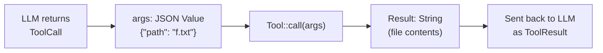

# Chapter 2: Your First Tool

Now that you have a mock provider, it is time to build your first tool. You will
implement `ReadTool` -- a tool that reads a file and returns its contents. This
is the simplest tool in our agent, but it introduces the `Tool` trait pattern
that every other tool follows.

## Goal

Implement `ReadTool` so that:

1. It declares its name, description, and parameter schema.
2. When called with a `{"path": "some/file.txt"}` argument, it reads the file
   and returns its contents as a string.
3. Missing arguments or non-existent files produce errors.

## Key Rust concepts

### The `Tool` trait

Open `mini-claw-code-starter/src/types.rs` and look at the `Tool` trait:

```rust
#[async_trait::async_trait]
pub trait Tool: Send + Sync {
    fn definition(&self) -> &ToolDefinition;
    async fn call(&self, args: Value) -> anyhow::Result<String>;
}
```

Two methods:

- **`definition()`** returns metadata about the tool: its name, a description,
  and a JSON schema describing its parameters. The LLM uses this to decide which
  tool to call and how to format the arguments.
- **`call()`** actually executes the tool. It receives a `serde_json::Value`
  containing the arguments and returns a string result.

### `ToolDefinition`

```rust
pub struct ToolDefinition {
    pub name: &'static str,
    pub description: &'static str,
    pub parameters: Value,
}
```

As you saw in Chapter 1, `ToolDefinition` has a builder API for declaring
parameters. For ReadTool, we need a single required parameter called `"path"`
of type `"string"`:

```rust
ToolDefinition::new("read", "Read the contents of a file.")
    .param("path", "string", "The file path to read", true)
```

Under the hood, the builder constructs the JSON Schema you saw in Chapter 1.
The last argument (`true`) marks the parameter as required.

### Why `#[async_trait]` instead of plain `async fn`?

You might wonder why we use the `async_trait` macro instead of writing
`async fn` directly in the trait. The reason is **trait object compatibility**.

Later, in the agent loop, we will store tools in a `ToolSet` -- a HashMap-backed
collection of different tool types behind a common interface. This requires
*dynamic dispatch*, which means the compiler needs to know the size of the
return type at compile time.

`async fn` in traits generates a different, uniquely-sized `Future` type for
each implementation. That breaks dynamic dispatch. The `#[async_trait]` macro
automatically rewrites `async fn` into a method that returns
`Pin<Box<dyn Future<...>>>`, which has a known, fixed size regardless of
which tool produced it. You write normal `async fn` code, and the macro
handles the boxing for you.

Here is the data flow when the agent calls a tool:



The LLM never touches the filesystem. It produces a JSON request, your code
executes it, and returns a string.

## The implementation

Open `mini-claw-code-starter/src/tools/read.rs`. The struct, `Default` impl, and
method signatures are already provided.

Remember to annotate your `impl Tool for ReadTool` block with
`#[async_trait::async_trait]`. The starter file already has this in place.

### Step 1: Implement `new()`

Create a `ToolDefinition` and store it in `self.definition`. Use the builder:

```rust
ToolDefinition::new("read", "Read the contents of a file.")
    .param("path", "string", "The file path to read", true)
```

### Step 2: `definition()` -- already provided

The `definition()` method is already implemented in the starter -- it simply
returns `&self.definition`. No work needed here.

### Step 3: Implement `call()`

This is where the real work happens. Your implementation should:

1. Extract the `"path"` argument from `args`.
2. Read the file asynchronously.
3. Return the file contents.

Here is the shape:

```rust
async fn call(&self, args: Value) -> anyhow::Result<String> {
    // 1. Extract path
    // 2. Read file with tokio::fs::read_to_string
    // 3. Return contents
}
```

Some useful APIs:

- `args["path"].as_str()` returns `Option<&str>`. Use `.context("missing 'path' argument")?`
  from `anyhow` to convert `None` into a descriptive error.
- `tokio::fs::read_to_string(path).await` reads a file asynchronously. Chain
  `.with_context(|| format!("failed to read '{path}'"))?` for a clear error message.

That is it -- extract the path, read the file, return the contents.

## Running the tests

Run the Chapter 2 tests:

```bash
cargo test -p mini-claw-code-starter ch2
```

### What the tests verify

- **`test_ch2_read_definition`**: Creates a `ReadTool` and checks that its
  name is `"read"`, description is non-empty, and `"path"` is in the required
  parameters.
- **`test_ch2_read_file`**: Creates a temp file with known content, calls
  `ReadTool` with the file path, and checks the returned content matches.
- **`test_ch2_read_missing_file`**: Calls `ReadTool` with a path that does not
  exist and verifies it returns an error.
- **`test_ch2_read_missing_arg`**: Calls `ReadTool` with an empty JSON object
  (no `"path"` key) and verifies it returns an error.

There are also additional edge-case tests (empty files, unicode content,
wrong argument types, etc.) that will pass once your core implementation is
correct.

## Recap

You built your first tool by implementing the `Tool` trait. The key patterns:

- **`ToolDefinition::new(...).param(...)`** declares the tool's name,
  description, and parameters.
- **`#[async_trait::async_trait]`** on the `impl` block lets you write
  `async fn call()` while keeping trait object compatibility.
- **`tokio::fs`** for async file I/O.
- **`anyhow::Context`** for adding descriptive error messages.

Every tool in the agent follows this exact same structure. Once you understand
`ReadTool`, the remaining tools are variations on the theme.

## What's next

In [Chapter 3: Single Turn](./ch03-single-turn.md) you will write a function
that matches on `StopReason` to handle a single round of tool calls.
