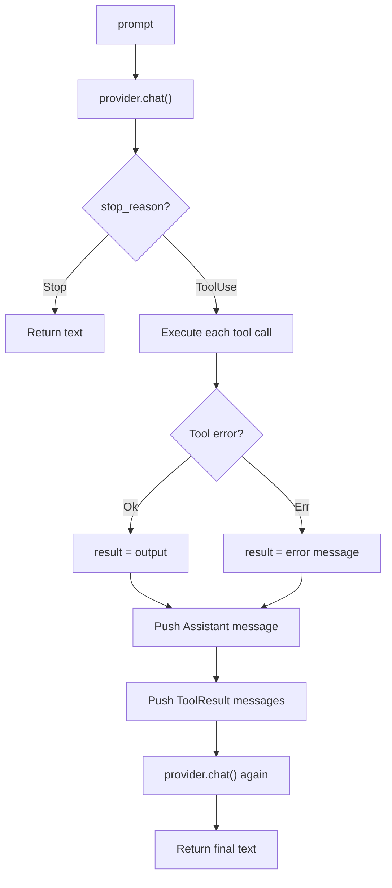
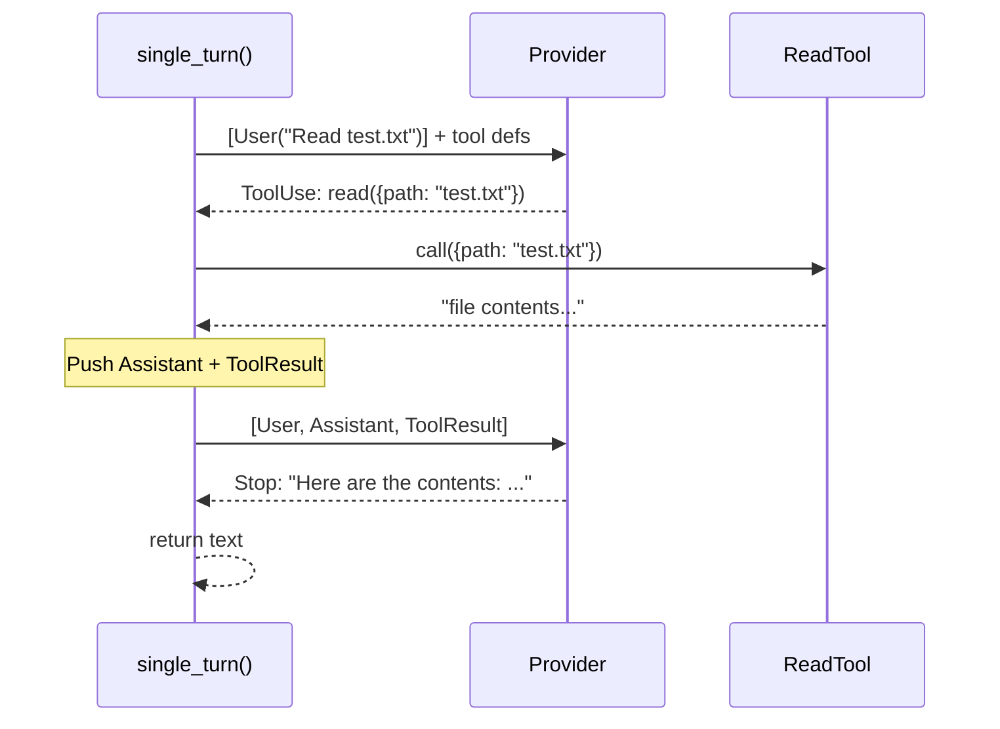
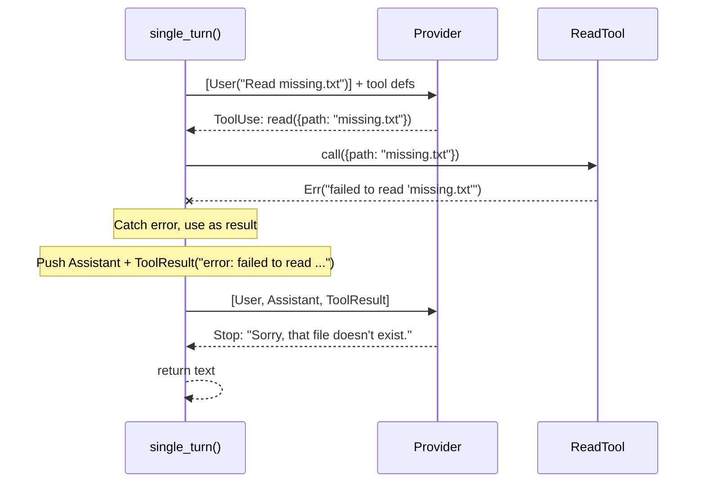

# Chapter 3: Single Turn

You have a provider and a tool. Before jumping to the full agent loop, let's
see the raw protocol: the LLM returns a `stop_reason` that tells you whether
it is done or wants to use tools. In this chapter you will write a function
that handles exactly one prompt with at most one round of tool calls.

## Goal

Implement `single_turn()` so that:

1. It sends a prompt to the provider.
2. It matches on `stop_reason`.
3. If `Stop` -- return the text.
4. If `ToolUse` -- execute the tools, send results back, return the final text.

No loop. Just one turn.

## Key Rust concepts

### `ToolSet` -- a HashMap of tools

The function signature takes a `&ToolSet` instead of a raw slice or vector:

```rust
pub async fn single_turn<P: Provider>(
    provider: &P,
    tools: &ToolSet,
    prompt: &str,
) -> anyhow::Result<String>
```

`ToolSet` wraps a `HashMap<String, Box<dyn Tool>>` and indexes tools by their
definition name. This gives O(1) lookup when executing tool calls instead of
scanning a list. The builder API auto-extracts the name from each tool's
definition:

```rust
let tools = ToolSet::new().with(ReadTool::new());
let result = single_turn(&provider, &tools, "Read test.txt").await?;
```

### `match` on `StopReason`

This is the core teaching point. Instead of checking `tool_calls.is_empty()`,
you explicitly match on the stop reason:

```rust
match turn.stop_reason {
    StopReason::Stop => { /* return text */ }
    StopReason::ToolUse => { /* execute tools */ }
}
```

This makes the protocol visible. The LLM is telling you what to do, and you
handle each case explicitly.

Here is the complete flow of `single_turn()`:



The key difference from the full agent loop (Chapter 5) is that there is no
outer loop here. If the LLM asks for tools a second time, `single_turn()` does
not handle it -- that is what the agent loop is for.

## The implementation

Open `mini-claw-code-starter/src/agent.rs`. You will see the `single_turn()`
function signature at the top of the file, before the `SimpleAgent` struct.

### Step 1: Collect tool definitions

`ToolSet` has a `definitions()` method that returns all tool schemas:

```rust
let defs = tools.definitions();
```

### Step 2: Create the initial message

```rust
let mut messages = vec![Message::User(prompt.to_string())];
```

### Step 3: Call the provider

```rust
let turn = provider.chat(&messages, &defs).await?;
```

### Step 4: Match on `stop_reason`

This is the heart of the function:

```rust
match turn.stop_reason {
    StopReason::Stop => Ok(turn.text.unwrap_or_default()),
    StopReason::ToolUse => {
        // execute tools, send results, get final answer
    }
}
```

For the `ToolUse` branch:

1. For each tool call, find the matching tool and call it. **Collect the
   results into a `Vec` first** -- you will need `turn.tool_calls` for this,
   so you cannot move `turn` yet.
2. Push `Message::Assistant(turn)` and then `Message::ToolResult` for each
   result. Pushing the assistant turn moves `turn`, which is why you must
   collect results beforehand.
3. Call the provider again to get the final answer.
4. Return `final_turn.text.unwrap_or_default()`.

The tool-finding and execution logic is the same as what you will use in the
agent loop (Chapter 5):

```rust
println!("{}", tool_summary(call));
let content = match tools.get(&call.name) {
    Some(t) => t.call(call.arguments.clone()).await
        .unwrap_or_else(|e| format!("error: {e}")),
    None => format!("error: unknown tool `{}`", call.name),
};
```

The `tool_summary()` helper prints each tool call to the terminal so you can
see which tools the agent is using and what arguments it passed. For example,
`[bash: ls -la]` or `[read: src/main.rs]`. (The reference implementation uses
`print!("\x1b[2K\r...")` instead of `println!` to clear the `thinking...`
indicator line before printing -- you'll see this pattern in Chapter 7. A plain
`println!` works fine for now.)

### Error handling -- never crash the loop

Notice that tool errors are **caught, not propagated**. The `.unwrap_or_else()`
converts any error into a string like `"error: failed to read 'missing.txt'"`.
This string is sent back to the LLM as a normal tool result. The LLM can then
decide what to do -- try a different file, use another tool, or explain the
problem to the user.

The same applies to unknown tools -- instead of panicking, you send an error
message back as a tool result.

This is a key design principle: **the agent loop should never crash because of
a tool failure**. Tools operate on the real world (files, processes, network),
and failures are expected. The LLM is smart enough to recover if you give it
the error message.

Here is the message sequence for a successful tool call:



And here is what happens when a tool fails (e.g. file not found):



The error does not crash the agent. It becomes a tool result that the LLM
reads and responds to.

## Running the tests

Run the Chapter 3 tests:

```bash
cargo test -p mini-claw-code-starter ch3
```

### What the tests verify

- **`test_ch3_direct_response`**: Provider returns `StopReason::Stop`.
  `single_turn` should return the text directly.
- **`test_ch3_one_tool_call`**: Provider returns `StopReason::ToolUse` with
  a `read` tool call, then `StopReason::Stop`. Verifies the file was read
  and the final text is returned.
- **`test_ch3_unknown_tool`**: Provider returns `StopReason::ToolUse` for a
  tool that does not exist. Verifies the error message is sent as a tool
  result and the final text is returned.

- **`test_ch3_tool_error_propagates`**: Provider requests a `read` on a file
  that does not exist. The error should be caught and sent back to the LLM as
  a tool result (not crash the function). The LLM then responds with text.

There are also additional edge-case tests (empty responses, multiple tool
calls in one turn, etc.) that will pass once your core implementation is
correct.

## Recap

You have written the simplest possible handler for the LLM protocol:

- **Match on `StopReason`** -- the model tells you what to do next.
- **No loop** -- you handle at most one round of tool calls.
- **`ToolSet`** -- a HashMap-backed collection with O(1) tool lookup by name.

This is the foundation. In Chapter 5 you will wrap this same logic in a loop
to create the full agent.

## What's next

In [Chapter 4: More Tools](./ch04-more-tools.md) you will implement three
more tools: `BashTool`, `WriteTool`, and `EditTool`.
