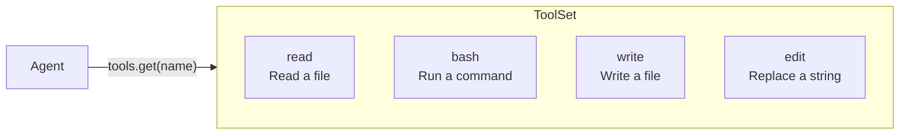
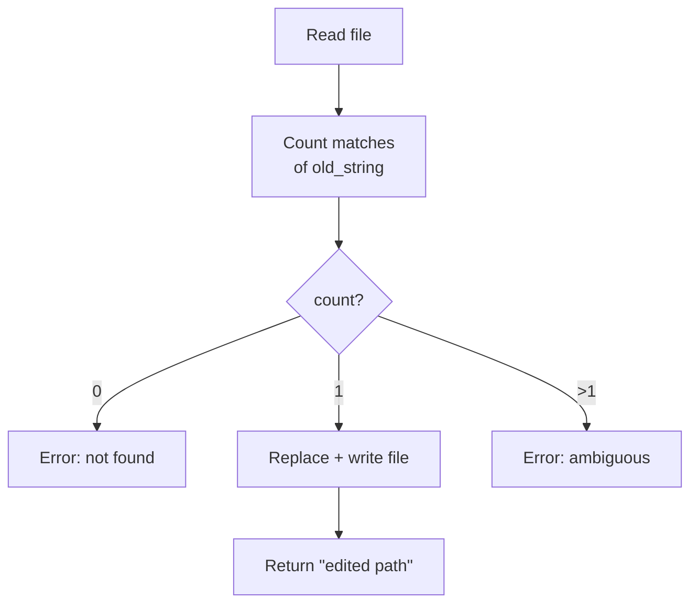

# Chapter 4: More Tools

You have already implemented `ReadTool` and understand the `Tool` trait pattern.
Now you will implement three more tools: `BashTool`, `WriteTool`, and `EditTool`.
Each follows the same structure -- define a schema, implement `call()` -- so this
chapter reinforces the pattern through repetition.

By the end of this chapter your agent will have all four tools it needs to
interact with the file system and execute commands.



## Goal

Implement three tools:

1. **BashTool** -- run a shell command and return its output.
2. **WriteTool** -- write content to a file, creating directories as needed.
3. **EditTool** -- replace an exact string in a file (must appear exactly once).

## Key Rust concepts

### `tokio::process::Command`

Tokio provides an async wrapper around `std::process::Command`. You will use it
in `BashTool`:

```rust
let output = tokio::process::Command::new("bash")
    .arg("-c")
    .arg(command)
    .output()
    .await?;
```

This runs `bash -c "<command>"` and captures stdout and stderr. The `output`
struct has `stdout` and `stderr` fields as `Vec<u8>`, which you convert to
strings with `String::from_utf8_lossy()`.

### `bail!()` macro

The `anyhow::bail!()` macro is shorthand for returning an error immediately:

```rust
use anyhow::bail;

if count == 0 {
    bail!("not found");
}
// equivalent to:
// return Err(anyhow::anyhow!("not found"));
```

You will use this in `EditTool` for validation.

Make sure to import it: `use anyhow::{Context, bail};`. The starter file
already includes this import in `edit.rs`.

### `create_dir_all`

When writing a file to a path like `a/b/c/file.txt`, the parent directories
might not exist. `tokio::fs::create_dir_all` creates the entire directory tree:

```rust
if let Some(parent) = std::path::Path::new(path).parent() {
    tokio::fs::create_dir_all(parent).await?;
}
```

---

## Tool 1: BashTool

Open `mini-claw-code-starter/src/tools/bash.rs`.

### Schema

Use the builder pattern you learned in Chapter 2:

```rust
ToolDefinition::new("bash", "Run a bash command and return its output.")
    .param("command", "string", "The bash command to run", true)
```

### Implementation

The `call()` method should:

1. Extract `"command"` from args.
2. Run `bash -c <command>` using `tokio::process::Command`.
3. Capture stdout and stderr.
4. Build a result string:
   - Start with stdout (if non-empty).
   - Append stderr prefixed with `"stderr: "` (if non-empty).
   - If both are empty, return `"(no output)"`.

Think about how you combine stdout and stderr. If both are present, you want
them separated by a newline. Something like:

```rust
let mut result = String::new();
if !stdout.is_empty() {
    result.push_str(&stdout);
}
if !stderr.is_empty() {
    if !result.is_empty() {
        result.push('\n');
    }
    result.push_str("stderr: ");
    result.push_str(&stderr);
}
if result.is_empty() {
    result.push_str("(no output)");
}
```

---

## Tool 2: WriteTool

Open `mini-claw-code-starter/src/tools/write.rs`.

### Schema

```rust
ToolDefinition::new("write", "Write content to a file, creating directories as needed.")
    .param("path", "string", "The file path to write to", true)
    .param("content", "string", "The content to write to the file", true)
```

### Implementation

The `call()` method should:

1. Extract `"path"` and `"content"` from args.
2. Create parent directories if they do not exist.
3. Write the content to the file.
4. Return a confirmation message like `"wrote {path}"`.

For creating parent directories:

```rust
if let Some(parent) = std::path::Path::new(path).parent() {
    tokio::fs::create_dir_all(parent).await
        .with_context(|| format!("failed to create directories for '{path}'"))?;
}
```

Then write the file:

```rust
tokio::fs::write(path, content).await
    .with_context(|| format!("failed to write '{path}'"))?;
```

---

## Tool 3: EditTool

Open `mini-claw-code-starter/src/tools/edit.rs`.

### Schema

```rust
ToolDefinition::new("edit", "Replace an exact string in a file (must appear exactly once).")
    .param("path", "string", "The file path to edit", true)
    .param("old_string", "string", "The exact string to find and replace", true)
    .param("new_string", "string", "The replacement string", true)
```

### Implementation

The `call()` method is the most interesting of the bunch. It should:

1. Extract `"path"`, `"old_string"`, and `"new_string"` from args.
2. Read the file contents.
3. Count how many times `old_string` appears in the content.
4. If the count is 0, return an error: the string was not found.
5. If the count is greater than 1, return an error: the string is ambiguous.
6. Replace the single occurrence and write the file back.
7. Return a confirmation like `"edited {path}"`.

The validation is important -- requiring exactly one match prevents accidental
edits in the wrong place.



Useful APIs:

- `content.matches(old).count()` counts occurrences of a substring.
- `content.replacen(old, new, 1)` replaces the first occurrence.
- `bail!("old_string not found in '{path}'")`  for the not-found case.
- `bail!("old_string appears {count} times in '{path}', must be unique")` for
  the ambiguous case.

---

## Running the tests

Run the Chapter 4 tests:

```bash
cargo test -p mini-claw-code-starter ch4
```

### What the tests verify

**BashTool:**
- **`test_ch4_bash_definition`**: Checks name is `"bash"` and `"command"` is
  required.
- **`test_ch4_bash_runs_command`**: Runs `echo hello` and checks the output
  contains `"hello"`.
- **`test_ch4_bash_captures_stderr`**: Runs `echo err >&2` and checks stderr
  is captured.
- **`test_ch4_bash_missing_arg`**: Passes empty args and expects an error.

**WriteTool:**
- **`test_ch4_write_definition`**: Checks name is `"write"`.
- **`test_ch4_write_creates_file`**: Writes to a temp file and reads it back.
- **`test_ch4_write_creates_dirs`**: Writes to `a/b/c/out.txt` and verifies
  directories were created.
- **`test_ch4_write_missing_arg`**: Passes only `"path"` (no `"content"`) and
  expects an error.

**EditTool:**
- **`test_ch4_edit_definition`**: Checks name is `"edit"`.
- **`test_ch4_edit_replaces_string`**: Edits `"hello"` to `"goodbye"` in a file
  containing `"hello world"` and checks the result is `"goodbye world"`.
- **`test_ch4_edit_not_found`**: Tries to replace a string that does not exist
  and expects an error.
- **`test_ch4_edit_not_unique`**: Tries to replace `"a"` in a file containing
  `"aaa"` (three occurrences) and expects an error.

There are also additional edge-case tests for each tool (wrong argument types,
missing arguments, output format checks, etc.) that will pass once your core
implementations are correct.

## Recap

You now have four tools, and they all follow the same pattern:

1. Define a `ToolDefinition` with `::new(...).param(...)` builder calls.
2. Return `&self.definition` from `definition()`.
3. Add `#[async_trait::async_trait]` on the `impl Tool` block and write
   `async fn call()`.

This is a deliberate design. The `Tool` trait makes every tool interchangeable
from the agent's perspective. The agent does not know or care how a tool works
internally -- it only needs the definition (to tell the LLM) and the call method
(to execute it).

## What's next

With a provider and four tools ready, it is time to connect them. In
[Chapter 5: Your First Agent SDK!](./ch05-agent-loop.md) you will build the
`SimpleAgent` -- the core loop that sends prompts to the provider, executes
tool calls, and iterates until the LLM gives a final answer.
