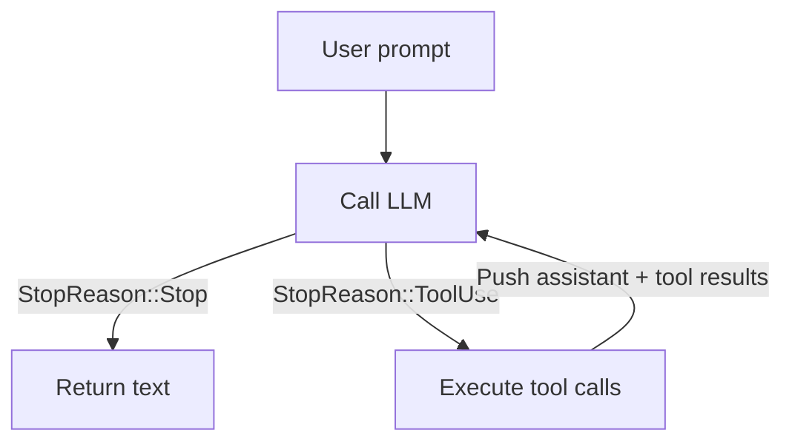

# Chapter 5: Your First Agent SDK!

This is the chapter where everything comes together. You have a provider that
returns `AssistantTurn` responses and four tools that execute actions. Now you
will build the `SimpleAgent` -- the loop that connects them.

This is the "aha!" moment of the tutorial. The agent loop is surprisingly
short, but it is the engine that makes an LLM into an agent.

## What is an agent loop?

In Chapter 3 you built `single_turn()` -- one prompt, one round of tool calls,
one final answer. That is enough when the LLM knows everything it needs after
reading a single file. But real tasks are messier:

> "Find the bug in this project and fix it."

The LLM might need to read five files, run the test suite, edit a source file,
run the tests again, and then report back. Each of those is a tool call, and
the LLM cannot plan them all upfront because the result of one call determines
the next. It needs a **loop**.

The agent loop is that loop:



1. Send messages to the LLM.
2. If the LLM says "I'm done" (`StopReason::Stop`), return its text.
3. If the LLM says "I need tools" (`StopReason::ToolUse`), execute them.
4. Append the assistant turn and tool results to the message history.
5. Go to step 1.

That is the entire architecture of every coding agent -- Claude Code, Cursor,
OpenCode, Copilot. The details vary (streaming, parallel tool calls, safety
checks), but the core loop is always the same. And you are about to build it
in about 30 lines of Rust.

## Goal

Implement `SimpleAgent` so that:

1. It holds a provider and a collection of tools.
2. You can register tools using a builder pattern (`.tool(ReadTool::new())`).
3. The `run()` method implements the tool-calling loop: prompt -> provider ->
   tool calls -> tool results -> provider -> ... -> final text.

## Key Rust concepts

### Generics with trait bounds

```rust
pub struct SimpleAgent<P: Provider> {
    provider: P,
    tools: ToolSet,
}
```

The `<P: Provider>` means `SimpleAgent` is generic over any type that
implements the `Provider` trait. When you use `MockProvider`, the compiler
generates code specialized for `MockProvider`. When you use
`OpenRouterProvider`, it generates code for that type. Same logic, different
providers.

### `ToolSet` -- a HashMap of trait objects

The `tools` field is a `ToolSet`, which wraps a `HashMap<String, Box<dyn Tool>>`
internally. Each value is a heap-allocated *trait object* that implements `Tool`,
but the concrete types can differ. One might be a `ReadTool`, the next a
`BashTool`. The HashMap key is the tool's name, giving O(1) lookup when executing
tool calls.

Why trait objects (`Box<dyn Tool>`) instead of generics? Because you need a
**heterogeneous collection**. A `Vec<T>` requires all elements to be the same
type. With `Box<dyn Tool>`, you erase the concrete type and store them all
behind the same interface.

This is why the `Tool` trait uses `#[async_trait]` -- the macro rewrites
`async fn` into a boxed future with a uniform type across different tool
implementations.

### The builder pattern

The `tool()` method takes `self` by value (not `&mut self`) and returns `Self`:

```rust
pub fn tool(mut self, t: impl Tool + 'static) -> Self {
    // push the tool
    self
}
```

This lets you chain calls:

```rust
let agent = SimpleAgent::new(provider)
    .tool(BashTool::new())
    .tool(ReadTool::new())
    .tool(WriteTool::new())
    .tool(EditTool::new());
```

The `impl Tool + 'static` parameter accepts any type implementing `Tool` with
a `'static` lifetime (meaning it does not borrow temporary data). Inside the
method, you push it into the `ToolSet`, which boxes it and indexes it by name.

## The implementation

Open `mini-claw-code-starter/src/agent.rs`. The struct definition and method
signatures are provided.

### Step 1: Implement `new()`

Store the provider and initialize an empty `ToolSet`:

```rust
pub fn new(provider: P) -> Self {
    Self {
        provider,
        tools: ToolSet::new(),
    }
}
```

This one is straightforward.

### Step 2: Implement `tool()`

Push the tool into the set, return self:

```rust
pub fn tool(mut self, t: impl Tool + 'static) -> Self {
    self.tools.push(t);
    self
}
```

### Step 3: Implement `run()` -- the core loop

This is the heart of the agent. Here is the flow:

1. Collect tool definitions from all registered tools.
2. Create a `messages` vector starting with the user's prompt.
3. Loop:
   a. Call `self.provider.chat(&messages, &defs)` to get an `AssistantTurn`.
   b. Match on `turn.stop_reason`:
      - `StopReason::Stop` -- the LLM is done, return `turn.text`.
      - `StopReason::ToolUse` -- for each tool call:
        1. Find the matching tool by name.
        2. Call it with the arguments.
        3. Collect the result.
   c. Push the `AssistantTurn` as a `Message::Assistant`.
   d. Push each tool result as a `Message::ToolResult`.
   e. Continue the loop.

Think about the data flow carefully. After executing tools, you push *both* the
assistant's turn (so the LLM can see what it requested) *and* the tool results
(so it can see what happened). This gives the LLM full context to decide what
to do next.

### Gathering tool definitions

At the start of `run()`, collect all tool definitions from the `ToolSet`:

```rust
let defs = self.tools.definitions();
```

### The loop structure

This is `single_turn()` (from Chapter 3) wrapped in a loop. Instead of
handling just one round, we `match` on `stop_reason` inside a `loop`:

```rust
loop {
    let turn = self.provider.chat(&messages, &defs).await?;

    match turn.stop_reason {
        StopReason::Stop => return Ok(turn.text.unwrap_or_default()),
        StopReason::ToolUse => {
            // Execute tool calls, collect results
            // Push messages
        }
    }
}
```

### Finding and calling tools

For each tool call, look it up by name in the `ToolSet`:

```rust
println!("{}", tool_summary(call));
let content = match self.tools.get(&call.name) {
    Some(t) => t.call(call.arguments.clone()).await
        .unwrap_or_else(|e| format!("error: {e}")),
    None => format!("error: unknown tool `{}`", call.name),
};
```

The `tool_summary()` helper prints each tool call to the terminal -- one line
per tool with its key argument, so you can watch what the agent does in real
time. For example: `[bash: cat Cargo.toml]` or `[write: src/lib.rs]`.

### Error handling

Tool errors are caught with `.unwrap_or_else()` and converted into a string
that gets sent back to the LLM as a tool result. This is the same pattern from
Chapter 3, and it is critical here because the agent loop runs multiple
iterations. If a tool error crashed the loop, the agent would die on the first
missing file or failed command. Instead, the LLM sees the error and can
recover -- try a different path, adjust the command, or explain the problem.

```text
> What's in README.md?
[read: README.md]          <-- tool fails (file not found)
[read: Cargo.toml]         <-- LLM recovers, tries another file
Here is the project info from Cargo.toml...
```

Unknown tools are handled the same way -- an error string as the tool result,
not a crash.

### Pushing messages

After executing all tool calls for a turn, push the assistant message and the
tool results. You need to collect results first (because the `turn` is moved
into `Message::Assistant`):

```rust
let mut results = Vec::new();
for call in &turn.tool_calls {
    // ... execute and collect (id, content) pairs
}

messages.push(Message::Assistant(turn));
for (id, content) in results {
    messages.push(Message::ToolResult { id, content });
}
```

The order matters: assistant message first, then tool results. This matches the
format that LLM APIs expect.

## Running the tests

Run the Chapter 5 tests:

```bash
cargo test -p mini-claw-code-starter ch5
```

### What the tests verify

- **`test_ch5_text_response`**: Provider returns text immediately (no tools).
  Agent should return that text.
- **`test_ch5_single_tool_call`**: Provider first requests a `read` tool call,
  then returns text. Agent should execute the tool and return the final text.
- **`test_ch5_unknown_tool`**: Provider requests a tool that does not exist.
  Agent should handle it gracefully (return an error string as the tool result)
  and continue to get the final text.
- **`test_ch5_multi_step_loop`**: Provider requests `read` twice across two
  turns, then returns text. Verifies the loop runs multiple iterations.
- **`test_ch5_empty_response`**: Provider returns `None` for text and no tool
  calls. Agent should return an empty string.
- **`test_ch5_builder_chain`**: Verifies that `.tool().tool()` chaining
  compiles -- a compile-time check for the builder pattern.

- **`test_ch5_tool_error_propagates`**: Provider requests a `read` on a file
  that does not exist. The error should be caught and sent back as a tool
  result. The LLM then responds with text. Verifies the loop does not crash
  on tool failures.

There are also additional edge-case tests (three-step loops, multi-tool
pipelines, etc.) that will pass once your core implementation is correct.

## Seeing it all work

Once the tests pass, take a moment to appreciate what you have built. With
about 30 lines of code in `run()`, you have a working agent loop. Here is what
happens when a test runs `agent.run("Read test.txt")`:

1. Messages: `[User("Read test.txt")]`
2. Provider returns: tool call for `read` with `{"path": "test.txt"}`
3. Agent calls `ReadTool::call()`, gets file contents
4. Messages: `[User("Read test.txt"), Assistant(tool_call), ToolResult("file content")]`
5. Provider returns: text response
6. Agent returns the text

The mock provider makes this deterministic and testable. But the exact same
loop works with a real LLM provider -- you just swap `MockProvider` for
`OpenRouterProvider`.

## Recap

The agent loop is the core of the framework:

- **Generics** (`<P: Provider>`) let it work with any provider.
- **`ToolSet`** (a HashMap of `Box<dyn Tool>`) gives O(1) tool lookup by name.
- **The builder pattern** makes setup ergonomic.
- **Error resilience** -- tool errors are caught and sent back to the LLM, not propagated. The loop never crashes from a tool failure.
- **The loop** is simple: call provider, match on `stop_reason`, execute tools, feed results back, repeat.

## What's next

Your agent works, but only with the mock provider. In
[Chapter 6: The OpenRouter Provider](./ch06-http-provider.md) you will implement
`OpenRouterProvider`, which talks to a real LLM API over HTTP. This is what
turns your agent from a testing harness into a real, usable tool.
