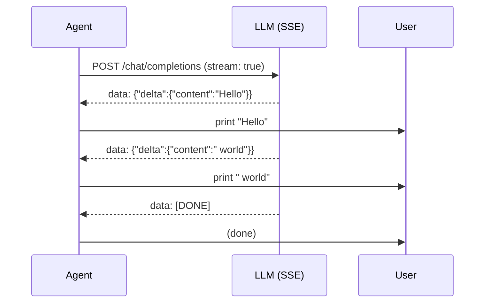
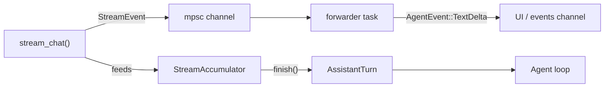

# Chapter 10: Streaming

In Chapter 6 you built `OpenRouterProvider::chat()`, which waits for the
*entire* response before returning. That works, but the user stares at a blank
screen until every token has been generated. Real coding agents print tokens as
they arrive -- that is streaming.

This chapter adds streaming support and a `StreamingAgent` -- the streaming
counterpart to `SimpleAgent`. You will:

1. Define a `StreamEvent` enum that represents real-time deltas.
2. Build a `StreamAccumulator` that collects deltas into a complete
   `AssistantTurn`.
3. Write a `parse_sse_line()` function that converts raw Server-Sent Events
   into `StreamEvent`s.
4. Define a `StreamProvider` trait -- the streaming counterpart to `Provider`.
5. Implement `StreamProvider` for `OpenRouterProvider`.
6. Build a `MockStreamProvider` for testing without HTTP.
7. Build `StreamingAgent<P: StreamProvider>` -- a full agent loop with
   real-time text streaming.

None of this touches the `Provider` trait or `SimpleAgent`. Streaming is
layered *on top* of the existing architecture.

## Why streaming?

Without streaming, a long response (say 500 tokens) makes the CLI feel frozen.
Streaming fixes three things:

- **Immediate feedback** -- the user sees the first word within milliseconds
  instead of waiting seconds for the full response.
- **Early cancellation** -- if the agent is heading in the wrong direction, the
  user can Ctrl-C without waiting for the full response.
- **Progress visibility** -- watching tokens arrive confirms the agent is
  working, not stuck.

## How SSE works

The OpenAI-compatible API supports streaming via
[Server-Sent Events (SSE)](https://developer.mozilla.org/en-US/docs/Web/API/Server-sent_events).
You set `"stream": true` in the request, and instead of one big JSON response,
the server sends a series of text lines:

```text
data: {"choices":[{"delta":{"content":"Hello"},"finish_reason":null}]}

data: {"choices":[{"delta":{"content":" world"},"finish_reason":null}]}

data: {"choices":[{"delta":{},"finish_reason":"stop"}]}

data: [DONE]
```

Each line starts with `data: ` followed by a JSON object (or the sentinel
`[DONE]`). The key difference from the non-streaming response: instead of a
`message` field with the complete text, each chunk has a `delta` field with
*just the new part*. Your code reads these deltas one by one, prints them
immediately, and accumulates them into the final result.

Here is the flow:



Tool calls stream the same way, but with `tool_calls` deltas instead of
`content` deltas. The tool call's name and arguments arrive in pieces that you
concatenate.

## StreamEvent

Open `mini-claw-code/src/streaming.rs`. The `StreamEvent` enum is our domain type
for streaming deltas:

```rust
#[derive(Debug, Clone, PartialEq)]
pub enum StreamEvent {
    /// A chunk of assistant text.
    TextDelta(String),
    /// A new tool call has started.
    ToolCallStart { index: usize, id: String, name: String },
    /// More argument JSON for a tool call in progress.
    ToolCallDelta { index: usize, arguments: String },
    /// The stream is complete.
    Done,
}
```

This is the interface between the SSE parser and the rest of the application.
The parser produces `StreamEvent`s; the UI consumes them for display; the
accumulator collects them into an `AssistantTurn`.

## StreamAccumulator

The accumulator is a simple state machine. It keeps a running `text` buffer
and a list of partial tool calls. Each `feed()` call appends to the
appropriate place:

```rust
pub struct StreamAccumulator {
    text: String,
    tool_calls: Vec<PartialToolCall>,
}

impl StreamAccumulator {
    pub fn new() -> Self { /* ... */ }
    pub fn feed(&mut self, event: &StreamEvent) { /* ... */ }
    pub fn finish(self) -> AssistantTurn { /* ... */ }
}
```

The implementation is straightforward:

- **`TextDelta`** → append to `self.text`.
- **`ToolCallStart`** → grow the `tool_calls` vec if needed, set the `id` and
  `name` at the given index.
- **`ToolCallDelta`** → append to the arguments string at the given index.
- **`Done`** → no-op (we handle completion in `finish()`).

`finish()` consumes the accumulator and builds an `AssistantTurn`:

```rust
pub fn finish(self) -> AssistantTurn {
    let text = if self.text.is_empty() { None } else { Some(self.text) };

    let tool_calls: Vec<ToolCall> = self.tool_calls
        .into_iter()
        .filter(|tc| !tc.name.is_empty())
        .map(|tc| ToolCall {
            id: tc.id,
            name: tc.name,
            arguments: serde_json::from_str(&tc.arguments)
                .unwrap_or(Value::Null),
        })
        .collect();

    let stop_reason = if tool_calls.is_empty() {
        StopReason::Stop
    } else {
        StopReason::ToolUse
    };

    AssistantTurn { text, tool_calls, stop_reason }
}
```

Notice that `arguments` is accumulated as a raw string and only parsed as JSON
at the very end. This is because the API sends argument fragments like
`{"pa` and `th": "f.txt"}` -- they are not valid JSON until concatenated.

## Parsing SSE lines

The `parse_sse_line()` function takes a single line from the SSE stream and
returns zero or more `StreamEvent`s:

```rust
pub fn parse_sse_line(line: &str) -> Option<Vec<StreamEvent>> {
    let data = line.strip_prefix("data: ")?;

    if data == "[DONE]" {
        return Some(vec![StreamEvent::Done]);
    }

    let chunk: ChunkResponse = serde_json::from_str(data).ok()?;
    // ... extract events from chunk.choices[0].delta
}
```

The SSE chunk types mirror the OpenAI delta format:

```rust
#[derive(Deserialize)]
struct ChunkResponse { choices: Vec<ChunkChoice> }

#[derive(Deserialize)]
struct ChunkChoice { delta: Delta, finish_reason: Option<String> }

#[derive(Deserialize)]
struct Delta {
    content: Option<String>,
    tool_calls: Option<Vec<DeltaToolCall>>,
}
```

For tool calls, the first chunk includes `id` and `function.name` (indicating
a new tool call). Subsequent chunks only have `function.arguments` fragments.
The parser emits `ToolCallStart` when `id` is present, and `ToolCallDelta` for
non-empty argument strings.

## StreamProvider trait

Just as `Provider` defines the non-streaming interface, `StreamProvider`
defines the streaming one:

```rust
pub trait StreamProvider: Send + Sync {
    fn stream_chat<'a>(
        &'a self,
        messages: &'a [Message],
        tools: &'a [&'a ToolDefinition],
        tx: mpsc::UnboundedSender<StreamEvent>,
    ) -> impl Future<Output = anyhow::Result<AssistantTurn>> + Send + 'a;
}
```

The key difference from `Provider::chat()` is the `tx` parameter -- an `mpsc`
channel sender. The implementation sends `StreamEvent`s through this channel
as they arrive *and* returns the final accumulated `AssistantTurn`. This gives
callers both real-time events and the complete result.

We keep `StreamProvider` separate from `Provider` rather than adding a method
to the existing trait. This means `SimpleAgent` and all existing code are
completely unaffected.

## Implementing StreamProvider for OpenRouterProvider

The implementation ties together SSE parsing, the accumulator, and the channel:

```rust
impl StreamProvider for OpenRouterProvider {
    async fn stream_chat(
        &self,
        messages: &[Message],
        tools: &[&ToolDefinition],
        tx: mpsc::UnboundedSender<StreamEvent>,
    ) -> anyhow::Result<AssistantTurn> {
        // 1. Build request with stream: true
        // 2. Send HTTP request
        // 3. Read response chunks in a loop:
        //    - Buffer incoming bytes
        //    - Split on newlines
        //    - parse_sse_line() each complete line
        //    - feed() each event into the accumulator
        //    - send each event through tx
        // 4. Return acc.finish()
    }
}
```

The buffering detail is important. HTTP responses may arrive in arbitrary byte
chunks that do not align with SSE line boundaries. So we maintain a `String`
buffer, append each chunk, and process only complete lines (splitting on `\n`):

```rust
let mut buffer = String::new();

while let Some(chunk) = resp.chunk().await? {
    buffer.push_str(&String::from_utf8_lossy(&chunk));

    while let Some(newline_pos) = buffer.find('\n') {
        let line = buffer[..newline_pos].trim_end_matches('\r').to_string();
        buffer = buffer[newline_pos + 1..].to_string();

        if line.is_empty() { continue; }

        if let Some(events) = parse_sse_line(&line) {
            for event in events {
                acc.feed(&event);
                let _ = tx.send(event);
            }
        }
    }
}
```

## MockStreamProvider

For testing, we need a streaming provider that does not make HTTP calls.
`MockStreamProvider` wraps the existing `MockProvider` and synthesizes
`StreamEvent`s from each canned `AssistantTurn`:

```rust
pub struct MockStreamProvider {
    inner: MockProvider,
}

impl StreamProvider for MockStreamProvider {
    async fn stream_chat(
        &self,
        messages: &[Message],
        tools: &[&ToolDefinition],
        tx: mpsc::UnboundedSender<StreamEvent>,
    ) -> anyhow::Result<AssistantTurn> {
        let turn = self.inner.chat(messages, tools).await?;

        // Synthesize stream events from the complete turn
        if let Some(ref text) = turn.text {
            for ch in text.chars() {
                let _ = tx.send(StreamEvent::TextDelta(ch.to_string()));
            }
        }
        for (i, call) in turn.tool_calls.iter().enumerate() {
            let _ = tx.send(StreamEvent::ToolCallStart {
                index: i, id: call.id.clone(), name: call.name.clone(),
            });
            let _ = tx.send(StreamEvent::ToolCallDelta {
                index: i, arguments: call.arguments.to_string(),
            });
        }
        let _ = tx.send(StreamEvent::Done);

        Ok(turn)
    }
}
```

It sends text one character at a time (simulating token-by-token streaming)
and each tool call as a start + delta pair. This lets us test `StreamingAgent`
without any network calls.

## StreamingAgent

Now for the main event. `StreamingAgent` is the streaming counterpart to
`SimpleAgent`. It has the same structure -- a provider, a tool set, and an
agent loop -- but it uses `StreamProvider` and emits `AgentEvent::TextDelta`
events in real time:

```rust
pub struct StreamingAgent<P: StreamProvider> {
    provider: P,
    tools: ToolSet,
}

impl<P: StreamProvider> StreamingAgent<P> {
    pub fn new(provider: P) -> Self { /* ... */ }
    pub fn tool(mut self, t: impl Tool + 'static) -> Self { /* ... */ }

    pub async fn run(
        &self,
        prompt: &str,
        events: mpsc::UnboundedSender<AgentEvent>,
    ) -> anyhow::Result<String> { /* ... */ }

    pub async fn chat(
        &self,
        messages: &mut Vec<Message>,
        events: mpsc::UnboundedSender<AgentEvent>,
    ) -> anyhow::Result<String> { /* ... */ }
}
```

The `chat()` method is the heart of the streaming agent. Let us walk through
it:

```rust
pub async fn chat(
    &self,
    messages: &mut Vec<Message>,
    events: mpsc::UnboundedSender<AgentEvent>,
) -> anyhow::Result<String> {
    let defs = self.tools.definitions();

    loop {
        // 1. Set up a stream channel
        let (stream_tx, mut stream_rx) = mpsc::unbounded_channel();

        // 2. Spawn a forwarder that converts StreamEvent::TextDelta
        //    into AgentEvent::TextDelta for the UI
        let events_clone = events.clone();
        let forwarder = tokio::spawn(async move {
            while let Some(event) = stream_rx.recv().await {
                if let StreamEvent::TextDelta(text) = event {
                    let _ = events_clone.send(AgentEvent::TextDelta(text));
                }
            }
        });

        // 3. Call stream_chat — this streams AND returns the turn
        let turn = self.provider.stream_chat(messages, &defs, stream_tx).await?;
        let _ = forwarder.await;

        // 4. Same stop_reason logic as SimpleAgent
        match turn.stop_reason {
            StopReason::Stop => {
                let text = turn.text.clone().unwrap_or_default();
                let _ = events.send(AgentEvent::Done(text.clone()));
                messages.push(Message::Assistant(turn));
                return Ok(text);
            }
            StopReason::ToolUse => {
                // Execute tools, push results, continue loop
                // (same pattern as SimpleAgent)
            }
        }
    }
}
```

The architecture has two channels flowing simultaneously:



The forwarder task is a bridge: it receives raw `StreamEvent`s from the
provider and converts `TextDelta` events into `AgentEvent::TextDelta` for the
UI. This keeps the provider's streaming protocol separate from the agent's
event protocol.

Notice that `AgentEvent` now has a `TextDelta` variant:

```rust
pub enum AgentEvent {
    TextDelta(String),  // NEW — streaming text chunks
    ToolCall { name: String, summary: String },
    Done(String),
    Error(String),
}
```

## Using StreamingAgent in the TUI

The TUI example (`examples/tui.rs`) uses `StreamingAgent` for the full
experience:

```rust
let provider = OpenRouterProvider::from_env()?;
let agent = Arc::new(
    StreamingAgent::new(provider)
        .tool(BashTool::new())
        .tool(ReadTool::new())
        .tool(WriteTool::new())
        .tool(EditTool::new()),
);
```

The agent is wrapped in `Arc` so it can be shared with spawned tasks. Each
turn spawns the agent and processes events with a spinner:

```rust
let (tx, mut rx) = mpsc::unbounded_channel();
let agent = agent.clone();
let mut msgs = std::mem::take(&mut history);
let handle = tokio::spawn(async move {
    let _ = agent.chat(&mut msgs, tx).await;
    msgs
});

// UI event loop — print TextDeltas, show spinner for tool calls
loop {
    tokio::select! {
        event = rx.recv() => {
            match event {
                Some(AgentEvent::TextDelta(text)) => print!("{text}"),
                Some(AgentEvent::ToolCall { summary, .. }) => { /* spinner */ },
                Some(AgentEvent::Done(_)) => break,
                // ...
            }
        }
        _ = tick.tick() => { /* animate spinner */ }
    }
}
```

Compare this to the `SimpleAgent` version from Chapter 9: the structure is
almost identical. The only difference is that `TextDelta` events let us print
tokens as they arrive instead of waiting for the full `Done` event.

## Running the tests

```bash
cargo test -p mini-claw-code ch10
```

The tests verify:

- **Accumulator**: text assembly, tool call assembly, mixed events, empty input,
  multiple parallel tool calls.
- **SSE parsing**: text deltas, tool call start/delta, `[DONE]`, non-data lines,
  empty deltas, invalid JSON, full multi-line sequences.
- **MockStreamProvider**: text responses synthesize char-by-char events; tool
  call responses synthesize start + delta events.
- **StreamingAgent**: text-only responses, tool call loops, and multi-turn chat
  history -- all using `MockStreamProvider` for deterministic testing.
- **Integration**: mock TCP servers that send real SSE responses to
  `stream_chat()` and verify both the returned `AssistantTurn` and the events
  sent through the channel.

## Recap

- **`StreamEvent`** represents real-time deltas: text chunks, tool call
  starts, argument fragments, and completion.
- **`StreamAccumulator`** collects deltas into a complete `AssistantTurn`.
- **`parse_sse_line()`** converts raw SSE `data:` lines into `StreamEvent`s.
- **`StreamProvider`** is the streaming counterpart to `Provider` -- it adds
  an `mpsc` channel parameter for real-time events.
- **`MockStreamProvider`** wraps `MockProvider` to synthesize streaming events
  for testing.
- **`StreamingAgent`** is the streaming counterpart to `SimpleAgent` -- same
  tool loop, but with real-time `TextDelta` events forwarded to the UI.
- The `Provider` trait and `SimpleAgent` are **unchanged**. Streaming is an
  additive feature layered on top.
