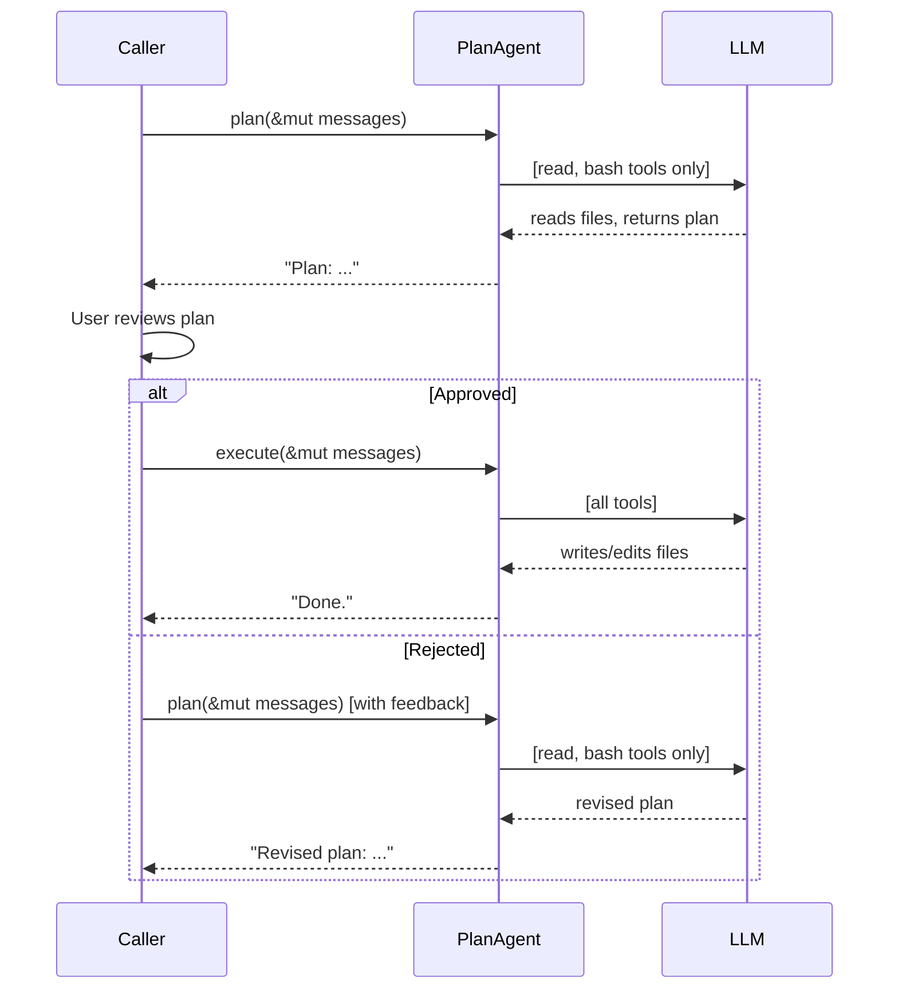

# Chapter 12: Plan Mode

Real coding agents can be dangerous. Give an LLM access to `write`, `edit`,
and `bash` and it might rewrite your config, delete a file, or run a
destructive command -- all before you've had a chance to review what it's doing.

**Plan mode** solves this with a two-phase workflow:

1. **Plan** -- the agent explores the codebase using read-only tools (`read`,
   `bash`, and `ask_user`). It cannot write, edit, or mutate anything. It
   returns a plan describing what it intends to do.
2. **Execute** -- after the user reviews and approves the plan, the agent runs
   again with all tools available.

This is exactly how Claude Code's plan mode works. In this chapter you'll build
`PlanAgent` -- a streaming agent with caller-driven approval gating.

You will:

1. Build `PlanAgent<P: StreamProvider>` with `plan()` and `execute()` methods.
2. Implement **double defense**: definition filtering *and* an execution guard.
3. Let the caller drive the approval flow between phases.
4. Reuse the streaming agent loop from Chapter 10.

## Why plan mode?

Consider this scenario:

```text
User: "Refactor auth.rs to use JWT instead of session cookies"

Agent (no plan mode):
  → calls write("auth.rs", ...) immediately
  → rewrites half your auth system
  → you didn't want that approach at all
```

With plan mode:

```text
User: "Refactor auth.rs to use JWT instead of session cookies"

Agent (plan phase):
  → calls read("auth.rs") to understand current code
  → calls bash("grep -r 'session' src/") to find related files
  → returns: "Plan: Replace SessionStore with JwtProvider in 3 files..."

User: "Looks good, go ahead."

Agent (execute phase):
  → calls write/edit with the approved changes
```

The key insight: **the same agent loop works for both phases**. The only
difference is *which tools are available*.

## Design

`PlanAgent` has the same shape as `StreamingAgent` -- a provider, a `ToolSet`,
and an agent loop. The difference is a `HashSet<&'static str>` that records
which tools are allowed during planning:

```rust
pub struct PlanAgent<P: StreamProvider> {
    provider: P,
    tools: ToolSet,
    read_only: HashSet<&'static str>,
}
```

Two public methods drive the two phases:

- **`plan()`** -- runs the agent loop with only read-only tools visible.
- **`execute()`** -- runs the agent loop with all tools visible.

Both delegate to a private `run_loop()` that takes an optional tool filter.

## The builder

Construction follows the same builder pattern as `SimpleAgent` and
`StreamingAgent`:

```rust
impl<P: StreamProvider> PlanAgent<P> {
    pub fn new(provider: P) -> Self {
        Self {
            provider,
            tools: ToolSet::new(),
            read_only: HashSet::from(["bash", "read", "ask_user"]),
        }
    }

    pub fn tool(mut self, t: impl Tool + 'static) -> Self {
        self.tools.push(t);
        self
    }

    pub fn read_only(mut self, names: &[&'static str]) -> Self {
        self.read_only = names.iter().copied().collect();
        self
    }
}
```

By default, `bash`, `read`, and `ask_user` are read-only. (Chapter 11 added
`ask_user` so the LLM can ask clarifying questions during planning.) The
`.read_only()` method lets callers override this -- for example, to exclude
`bash` from planning if you want a stricter mode.

## Double defense

Tool filtering uses two layers of protection:

### Layer 1: Definition filtering

During `plan()`, only read-only tool definitions are sent to the LLM. The
model literally cannot see `write` or `edit` in its tool list:

```rust
let all_defs = self.tools.definitions();
let defs: Vec<&ToolDefinition> = match allowed {
    Some(names) => all_defs
        .into_iter()
        .filter(|d| names.contains(d.name))
        .collect(),
    None => all_defs,
};
```

This is the primary defense. If the LLM doesn't know a tool exists, it
(usually) won't try to call it.

### Layer 2: Execution guard

But LLMs can hallucinate tool calls. If the model somehow calls `write` during
planning, the execution guard catches it and returns an error `ToolResult`
instead of executing the tool:

```rust
if let Some(names) = allowed
    && !names.contains(call.name.as_str())
{
    results.push((
        call.id.clone(),
        format!(
            "error: tool '{}' is not available in planning mode",
            call.name
        ),
    ));
    continue;
}
```

The error goes back to the LLM as a tool result, so it learns the tool is
blocked and adjusts its behavior. The file is never touched.

## The shared agent loop

Both `plan()` and `execute()` delegate to `run_loop()`. The only parameter
that differs is `allowed`:

```rust
pub async fn plan(
    &self,
    messages: &mut Vec<Message>,
    events: mpsc::UnboundedSender<AgentEvent>,
) -> anyhow::Result<String> {
    self.run_loop(messages, Some(&self.read_only), events).await
}

pub async fn execute(
    &self,
    messages: &mut Vec<Message>,
    events: mpsc::UnboundedSender<AgentEvent>,
) -> anyhow::Result<String> {
    self.run_loop(messages, None, events).await
}
```

`plan()` passes `Some(&self.read_only)` to restrict tools. `execute()` passes
`None` to allow everything.

The `run_loop` itself is identical to `StreamingAgent::chat()` from Chapter 10,
with the addition of the tool filter:

```rust
async fn run_loop(
    &self,
    messages: &mut Vec<Message>,
    allowed: Option<&HashSet<&'static str>>,
    events: mpsc::UnboundedSender<AgentEvent>,
) -> anyhow::Result<String> {
    // Filter definitions based on allowed set
    let all_defs = self.tools.definitions();
    let defs: Vec<&ToolDefinition> = match allowed {
        Some(names) => all_defs.into_iter()
            .filter(|d| names.contains(d.name)).collect(),
        None => all_defs,
    };

    loop {
        // Stream channel + forwarder (same as StreamingAgent)
        let (stream_tx, mut stream_rx) = mpsc::unbounded_channel();
        let events_clone = events.clone();
        let forwarder = tokio::spawn(async move {
            while let Some(event) = stream_rx.recv().await {
                if let StreamEvent::TextDelta(text) = event {
                    let _ = events_clone.send(AgentEvent::TextDelta(text));
                }
            }
        });

        let turn = match self.provider.stream_chat(
            messages, &defs, stream_tx
        ).await {
            Ok(t) => t,
            Err(e) => {
                let _ = events.send(AgentEvent::Error(e.to_string()));
                return Err(e);
            }
        };
        let _ = forwarder.await;

        match turn.stop_reason {
            StopReason::Stop => {
                let text = turn.text.clone().unwrap_or_default();
                let _ = events.send(AgentEvent::Done(text.clone()));
                messages.push(Message::Assistant(turn));
                return Ok(text);
            }
            StopReason::ToolUse => {
                let mut results = Vec::with_capacity(turn.tool_calls.len());
                for call in &turn.tool_calls {
                    // --- Execution guard ---
                    if let Some(names) = allowed
                        && !names.contains(call.name.as_str())
                    {
                        results.push((
                            call.id.clone(),
                            format!("error: tool '{}' is not available \
                                     in planning mode", call.name),
                        ));
                        continue;
                    }

                    // Execute the tool normally
                    let _ = events.send(AgentEvent::ToolCall {
                        name: call.name.clone(),
                        summary: tool_summary(call),
                    });
                    let content = match self.tools.get(&call.name) {
                        Some(t) => t.call(call.arguments.clone()).await
                            .unwrap_or_else(|e| format!("error: {e}")),
                        None => format!("error: unknown tool `{}`", call.name),
                    };
                    results.push((call.id.clone(), content));
                }

                messages.push(Message::Assistant(turn));
                for (id, content) in results {
                    messages.push(Message::ToolResult { id, content });
                }
            }
        }
    }
}
```

Compare this to `StreamingAgent::chat()` from Chapter 10. The structure is
identical -- the only additions are:

1. The `allowed` parameter and definition filtering at the top.
2. The execution guard inside the `ToolUse` branch.

## Caller-driven approval flow

The approval flow lives entirely in the caller. `PlanAgent` does not ask for
approval -- it just runs whichever phase is called. This keeps the agent
simple and lets the caller implement any approval UX they want.

Here is the typical flow:

```rust
let agent = PlanAgent::new(provider)
    .tool(ReadTool::new())
    .tool(WriteTool::new())
    .tool(EditTool::new())
    .tool(BashTool::new());

let mut messages = vec![Message::User("Refactor auth.rs".into())];

// Phase 1: Plan (read-only tools)
let (tx, rx) = mpsc::unbounded_channel();
let plan = agent.plan(&mut messages, tx).await?;
println!("Plan: {plan}");

// Show plan to user, get approval
if user_approves() {
    // Phase 2: Execute (all tools)
    messages.push(Message::User("Approved. Execute the plan.".into()));
    let (tx2, rx2) = mpsc::unbounded_channel();
    let result = agent.execute(&mut messages, tx2).await?;
    println!("Result: {result}");
} else {
    // Re-plan with feedback
    messages.push(Message::User("No, try a different approach.".into()));
    let (tx3, rx3) = mpsc::unbounded_channel();
    let revised_plan = agent.plan(&mut messages, tx3).await?;
    println!("Revised plan: {revised_plan}");
}
```

Notice how the same `messages` vec is shared across phases. This is critical --
the LLM sees its own plan, the user's approval (or rejection), and all
previous context when it enters the execute phase. Re-planning is just
pushing feedback as a `User` message and calling `plan()` again.



## Wiring it up

Add the module to `mini-claw-code/src/lib.rs`:

```rust
pub mod planning;
// ...
pub use planning::PlanAgent;
```

That's it. Like streaming, plan mode is a purely additive feature -- no
existing code is modified.

## Running the tests

```bash
cargo test -p mini-claw-code ch12
```

The tests verify:

- **Text response**: `plan()` returns text when the LLM stops immediately.
- **Read tool allowed**: `read` executes during planning.
- **Write tool blocked**: `write` is blocked during planning; the file is NOT
  created; an error `ToolResult` is sent back to the LLM.
- **Edit tool blocked**: same behavior for `edit`.
- **Execute allows write**: `write` works during execution; the file IS created.
- **Full plan-then-execute**: end-to-end flow -- plan reads a file, approval,
  execute writes a file.
- **Message continuity**: messages from the plan phase carry into the execute
  phase.
- **read_only override**: `.read_only(&["read"])` excludes `bash` from
  planning.
- **Streaming events**: `TextDelta` and `Done` events are emitted during
  planning.
- **Provider error**: empty mock propagates errors correctly.
- **Builder pattern**: chained `.tool().read_only()` compiles.

## Recap

- **`PlanAgent`** separates planning (read-only) from execution (all tools)
  using a single shared agent loop.
- **Double defense**: definition filtering prevents the LLM from seeing blocked
  tools; an execution guard catches hallucinated calls.
- **Caller-driven approval**: the agent doesn't manage approval -- the caller
  pushes approval/rejection as `User` messages and calls the appropriate phase.
- **Message continuity**: the same `messages` vec flows through both phases,
  giving the LLM full context.
- **Streaming**: both phases use `StreamProvider` and emit `AgentEvent`s, just
  like `StreamingAgent`.
- **Purely additive**: no changes to `SimpleAgent`, `StreamingAgent`, or any
  existing code.
