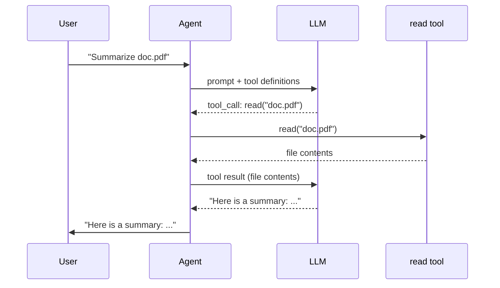
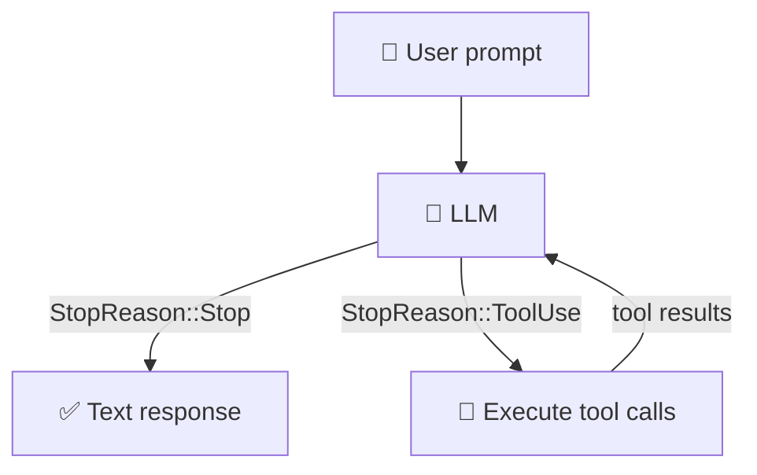

# 概述

欢迎阅读《用 Rust 构建你自己的迷你 Claw Code》。在接下来的七个章节中，你将从零开始实现一个迷你 coding agent——一个类似 Claude Code 或 OpenCode 的小型程序——它接收提示词（Prompt），与大语言模型（LLM）对话，并使用*工具（Tool）*与真实世界交互。之后，一系列扩展章节将添加流式传输、终端界面（TUI）、用户输入、计划模式等功能。

在本书结束时，你将拥有一个能运行 Shell 命令、读写文件、编辑代码的 agent，全部由 LLM 驱动。在第 6 章之前不需要 API 密钥，到那时默认模型是
[`openrouter/free`](https://openrouter.ai/docs/guides/routing/routers/free-models-router)
——OpenRouter 上的免费端点，无需任何费用。

## 什么是 AI agent？

LLM 本身只是一个函数：文本输入，文本输出。让它总结 `doc.pdf`，它要么拒绝，要么产生幻觉——因为它没有办法打开文件。

**Agent** 通过给 LLM 提供**工具（Tool）** 来解决这个问题。工具就是你的代码可以运行的函数——读取文件、执行 Shell 命令、调用 API。Agent 在一个循环中运行：

1. 将用户的提示词发送给 LLM。
2. LLM 判断它需要读取 `doc.pdf`，并输出一个工具调用。
3. 你的代码执行 `read` 工具，将文件内容返回。
4. LLM 现在有了文本内容，返回一个摘要。

LLM 从不直接接触文件系统。它只是*请求*，而你的代码*执行*。这个循环——请求、执行、反馈——就是全部的核心思想。

## LLM 如何使用工具？

LLM 无法执行代码。它是一个文本生成器。所以"调用工具"实际上意味着 LLM *输出一个结构化请求*，然后由你的代码完成剩余工作。

当你向 LLM 发送请求时，你会在对话旁附上一个**工具定义（Tool Definition）** 列表。每个定义包含一个名称、一段描述和一个描述参数的 JSON Schema。对于我们的 `read` 工具，它看起来像这样：

```json
{
  "name": "read",
  "description": "Read the contents of a file.",
  "parameters": {
    "type": "object",
    "properties": {
      "path": { "type": "string" }
    },
    "required": ["path"]
  }
}
```

LLM 读取这些定义的方式与读取用户提示词相同——它们只是输入的一部分。当它决定需要读取一个文件时，它不会运行任何代码。它生成一个**结构化输出**，如：

```json
{ "name": "read", "arguments": { "path": "doc.pdf" } }
```

同时附带一个信号，表示"我还没完成——我发起了一个工具调用。"你的代码解析这个输出，运行真正的函数，并将结果作为新消息发送回去。然后 LLM 在包含该结果的上下文中继续生成。

以下是"总结 doc.pdf"示例的完整交互过程：



LLM 的唯一职责是决定调用*哪个*工具以及传递*什么参数*。你的代码完成实际工作。

## 伪代码中的最小 agent

以下是上述示例的代码形式：

```text
tools    = [read_file]
messages = ["Summarize doc.pdf"]

loop:
    response = llm(messages, tools)

    if response.done:
        print(response.text)
        break

    // LLM 想要调用一个工具——执行它并将结果反馈回去。
    for call in response.tool_calls:
        result = execute(call.name, call.args)
        messages.append(result)
```

这就是整个 agent。本书的其余部分就是用 Rust 实现每一个组件——`llm` 函数、工具，以及连接它们的类型。

## 工具调用循环

以下是单次 agent 调用的流程：



1. 用户发送提示词。
2. LLM 要么返回文本（完成），要么请求一个或多个工具调用。
3. 你的代码执行每个工具并收集结果。
4. 结果作为新消息反馈给 LLM。
5. 从第 2 步重复，直到 LLM 返回文本。

这就是*整个*架构。其他一切都是实现细节。

## 我们将构建什么

我们将构建一个简单的 agent 框架，包含：

**4 个工具：**

| 工具  | 功能 |
|-------|------|
| `read`  | 读取文件内容 |
| `write` | 将内容写入文件（按需创建目录） |
| `edit`  | 替换文件中的精确字符串 |
| `bash`  | 运行 Shell 命令并捕获输出 |

**1 个提供者（Provider）：**

| Provider | 用途 |
|----------|------|
| `OpenRouterProvider` | 通过 OpenAI 兼容 API，经 HTTP 与真实 LLM 通信 |

测试使用 `MockProvider`，它返回预配置的响应，这样你无需 API 密钥就能运行完整的测试套件。

## 项目结构

该项目是一个 Cargo 工作区（Workspace），包含三个 crate 和一本教程书：

```text
mini-claw-code/
  Cargo.toml              # 工作区根目录
  mini-claw-code/             # 参考实现（先别偷看！）
  mini-claw-code-starter/     # 你的代码——在这里实现功能
  mini-claw-code-xtask/             # 辅助命令 (cargo x ...)
  mini-claw-code-book/              # 本教程
```

- **mini-claw-code** 包含完整的、可运行的实现。它的存在是为了让测试套件能验证练习是可解的，但你应该在自己尝试之前避免阅读它。
- **mini-claw-code-starter** 是你的工作 crate。每个源文件包含结构体定义、带有 `unimplemented!()` 函数体的 trait 实现，以及文档注释提示。你的任务是将 `unimplemented!()` 调用替换为真正的代码。
- **mini-claw-code-xtask** 提供 `cargo x` 辅助工具，包含 `check`、`solution-check` 和 `book` 命令。
- **mini-claw-code-book** 就是这本 mdbook 教程。

## 前置条件

在开始之前，请确保你有：

- 已安装 **Rust**（需要 1.85+，用于 edition 2024）。从 <https://rustup.rs> 安装。
- 基础的 Rust 知识：所有权、结构体、枚举、模式匹配，以及 `Result` / `Option`。如果你已读过《The Rust Programming Language》的前半部分，就可以开始了。
- 一个终端和一个文本编辑器。
- **mdbook**（可选，用于在本地阅读教程）。使用 `cargo install mdbook mdbook-mermaid` 安装。

在第 6 章之前你*不*需要 API 密钥。第 1 到 5 章使用 `MockProvider` 进行测试，所以一切都在本地运行。

## 设置

克隆仓库并验证能否构建：

```bash
git clone https://github.com/odysa/mini-claw-code.git
cd mini-claw-code
cargo build
```

然后验证测试工具是否工作：

```bash
cargo test -p mini-claw-code-starter ch1
```

测试应该会失败——这是预期的！你在第 1 章的任务就是让它们通过。

如果 `cargo x` 不工作，请确保你在工作区根目录（包含顶层 `Cargo.toml` 的目录）。

## 章节路线图

| 章节 | 主题 | 你将构建什么 |
|------|------|-------------|
| 1 | 核心类型 | `MockProvider` ——通过构建测试辅助工具来理解核心类型 |
| 2 | 你的第一个工具 | `ReadTool` ——读取文件 |
| 3 | 单轮对话 | `single_turn()` ——显式匹配 `StopReason`，一轮工具调用 |
| 4 | 更多工具 | `BashTool`、`WriteTool`、`EditTool` |
| 5 | 你的第一个 Agent SDK！ | `SimpleAgent` ——将 `single_turn()` 泛化为循环 |
| 6 | OpenRouter Provider | `OpenRouterProvider` ——与真实 LLM API 通信 |
| 7 | 简单的 CLI | 将所有组件连接成一个带有对话记忆的交互式 CLI |
| 8 | 奇点时刻 | 你的 agent 现在可以编写自身的代码了——接下来是什么 |

第 1--7 章是动手实践：你在 `mini-claw-code-starter` 中编写代码并运行测试来检验你的成果。第 8 章标志着向**扩展章节**（第 9 章以后）的过渡，这些章节将引导你阅读参考实现：

| 章节 | 主题 | 新增内容 |
|------|------|---------|
| 9 | 更好的 TUI | Markdown 渲染、加载动画、折叠的工具调用 |
| 10 | 流式传输 | 带有 SSE 解析和 `AgentEvent` 的 `StreamingAgent` |
| 11 | 用户输入 | `AskTool` ——让 LLM 向你提出澄清性问题 |
| 12 | 计划模式 | `PlanAgent` ——带有审批门控的只读计划阶段 |

第 1--7 章遵循相同的节奏：

1. 阅读本章以理解概念。
2. 在 `mini-claw-code-starter/src/` 中打开相应的源文件。
3. 将 `unimplemented!()` 调用替换为你的实现。
4. 运行 `cargo test -p mini-claw-code-starter chN` 检验你的成果。

准备好了？让我们开始构建一个 agent。

## 下一步

前往[第 1 章：核心类型](./ch01-core-types.md)，了解基础类型——`StopReason`、`Message` 和 `Provider` trait——并构建 `MockProvider`，你将在接下来四个章节中使用的测试辅助工具。
