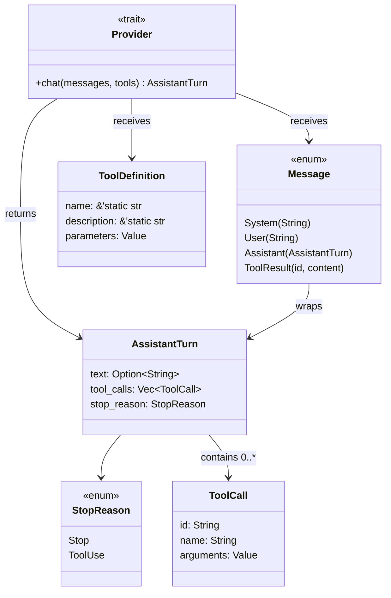
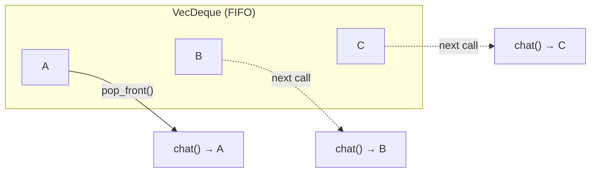

# 第一章：核心类型

在本章中，你将了解组成 agent 协议的各种类型——
`StopReason`、`AssistantTurn`、`Message` 以及 `Provider` trait。它们是
构建所有其他功能的基石。

为了验证你的理解，你将实现一个小型测试辅助工具：
`MockProvider`，一个返回预配置响应的结构体，让你在没有 API 密钥的情况下
测试后续章节的代码。

## 目标

理解核心类型，然后实现 `MockProvider`，使其满足以下要求：

1. 使用一个包含预设响应的 `VecDeque<AssistantTurn>` 来创建它。
2. 每次调用 `chat()` 返回序列中的下一个响应。
3. 如果所有响应都已消费完毕，则返回一个错误。

## 核心类型

打开 `mini-claw-code-starter/src/types.rs`。这些类型定义了
agent 与任何 LLM 后端之间的协议。

以下是它们之间的关系：



`Provider` 接收消息和工具定义，返回一个
`AssistantTurn`。该回合的 `stop_reason` 告诉你接下来该做什么。

### `ToolDefinition` 及其构建器

```rust
pub struct ToolDefinition {
    pub name: &'static str,
    pub description: &'static str,
    pub parameters: Value,
}
```

每个工具（tool）声明一个 `ToolDefinition`，告诉 LLM 它能做什么。
`parameters` 字段是一个 JSON Schema 对象，描述该工具的参数。

与其每次手动构建 JSON，`ToolDefinition` 提供了一个构建器（builder）API：

```rust
ToolDefinition::new("read", "Read the contents of a file.")
    .param("path", "string", "The file path to read", true)
```

- `new(name, description)` 创建一个带有空参数 schema 的定义。
- `param(name, type, description, required)` 添加一个参数并返回
  `self`，因此你可以链式调用。

从第二章开始，你将在每个工具中使用这个构建器。

### `StopReason` 和 `AssistantTurn`

```rust
pub enum StopReason {
    Stop,
    ToolUse,
}

pub struct AssistantTurn {
    pub text: Option<String>,
    pub tool_calls: Vec<ToolCall>,
    pub stop_reason: StopReason,
}
```

`ToolCall` 结构体保存单次工具调用的信息：

```rust
pub struct ToolCall {
    pub id: String,
    pub name: String,
    pub arguments: Value,
}
```

每个工具调用都有一个 `id`（用于将结果匹配回请求）、一个 `name`
（调用哪个工具）和 `arguments`（工具将要解析的 JSON 值）。

LLM 的每个响应都带有一个 `stop_reason`，告诉你模型*为什么*停止生成：

- **`StopReason::Stop`** -- 模型已完成。检查 `text` 获取响应内容。
- **`StopReason::ToolUse`** -- 模型想要调用工具。检查 `tool_calls`。

这就是原始的 LLM 协议：模型告诉你接下来该做什么。在第三章中，
你将编写一个函数，显式地对 `stop_reason` 进行 `match` 来处理每种情况。
在第五章中，你将把该 match 包裹在一个循环中，创建完整的 agent。

### `Provider` trait

```rust
pub trait Provider: Send + Sync {
    fn chat<'a>(
        &'a self,
        messages: &'a [Message],
        tools: &'a [&'a ToolDefinition],
    ) -> impl Future<Output = anyhow::Result<AssistantTurn>> + Send + 'a;
}
```

这段代码的意思是："一个 Provider 是能够接收一组消息和一组工具定义，
并异步返回一个 `AssistantTurn` 的东西。"

`Send + Sync` 约束意味着 provider 必须可以安全地在线程间共享。
这很重要，因为 `tokio`（异步运行时）可能会在线程之间移动任务。

注意 `chat()` 接收的是 `&self` 而不是 `&mut self`。真正的 provider
（`OpenRouterProvider`）不需要可变性——它只是发送 HTTP 请求。
如果将 trait 设计为 `&mut self`，就会强制每个调用者持有独占访问权，
这是不必要的限制。代价是：`MockProvider`（测试辅助工具）*确实*
需要修改其响应列表，因此它必须使用内部可变性（interior mutability）
来遵守该 trait。

### `Message` 枚举

```rust
pub enum Message {
    System(String),
    User(String),
    Assistant(AssistantTurn),
    ToolResult { id: String, content: String },
}
```

对话历史是一个 `Message` 值的列表：

- **`System(text)`** -- 系统提示词，设置 agent 的角色和行为。
  通常是历史记录中的第一条消息。
- **`User(text)`** -- 来自用户的提示。
- **`Assistant(turn)`** -- 来自 LLM 的响应（文本、工具调用或两者兼有）。
- **`ToolResult { id, content }`** -- 执行工具调用的结果。
  `id` 与 `ToolCall::id` 匹配，以便 LLM 知道该结果属于哪个调用。

从第三章构建 `single_turn()` 函数开始，你将使用这些变体。

### 为什么 `Provider` 使用 `impl Future` 而 `Tool` 使用 `#[async_trait]`

你可能会注意到，在第二章中 `Tool` trait 使用了 `#[async_trait]`，而
`Provider` 直接使用 `impl Future`。区别在于 trait 的使用方式：

- **`Provider`** 以*泛型*方式使用（`SimpleAgent<P: Provider>`）。
  编译器在编译时知道具体类型，因此 `impl Future` 可以工作。
- **`Tool`** 作为 *trait 对象*（`Box<dyn Tool>`）存储在一个包含不同工具类型的集合中。
  Trait 对象需要统一的返回类型，`#[async_trait]` 通过对 future 进行装箱来提供这一点。

当实现使用 `impl Future` 的 trait 时，你可以在 `impl` 块中直接写
`async fn`——Rust 会自动将其脱糖为 `impl Future` 形式。所以虽然
trait *定义*写的是 `-> impl Future<...>`，你的*实现*可以直接写
`async fn chat(...)`。

如果现在还不太理解这个区别，到第五章看到两种模式同时使用时就会豁然开朗。

### `ToolSet` -- 工具集合

还有一个类型你将从第三章开始使用：`ToolSet`。它包装了一个
`HashMap<String, Box<dyn Tool>>`，按名称索引工具，在执行工具调用时
提供 O(1) 查找。你可以用构建器来创建它：

```rust
let tools = ToolSet::new()
    .with(ReadTool::new())
    .with(BashTool::new());
```

你不需要实现 `ToolSet`——它已经在 `types.rs` 中提供。

## 实现 `MockProvider`

现在你已经理解了这些类型，让我们付诸实践。`MockProvider` 是一个
测试辅助工具——它通过返回预设响应而不是调用真实 LLM 来实现 `Provider`。
你将在第 2 到第 5 章中使用它来测试工具和 agent 循环，而无需 API 密钥。

打开 `mini-claw-code-starter/src/mock.rs`。你会看到结构体和方法签名
已经布置好，函数体为 `unimplemented!()`。

### 使用 `Mutex` 实现内部可变性

`MockProvider` 需要在每次调用 `chat()` 时从列表中*移除*响应。
但 `chat()` 接收的是 `&self`。如何通过共享引用进行修改呢？

Rust 的 `std::sync::Mutex` 提供了内部可变性（interior mutability）：
你将值包装在 `Mutex` 中，调用 `.lock().unwrap()` 即可获得一个可变的守卫（guard），
即使是通过 `&self`。锁确保同一时间只有一个线程访问数据。

```rust
use std::collections::VecDeque;
use std::sync::Mutex;

struct MyState {
    items: Mutex<VecDeque<String>>,
}

impl MyState {
    fn take_one(&self) -> Option<String> {
        self.items.lock().unwrap().pop_front()
    }
}
```

### 第一步：结构体字段

结构体已经有了你需要的字段：一个 `Mutex<VecDeque<AssistantTurn>>`
用于保存响应。这是预先提供的，以便方法签名能够编译通过。
你的任务是实现使用该字段的方法。

### 第二步：实现 `new()`

`new()` 方法接收一个 `VecDeque<AssistantTurn>`。我们需要 FIFO 顺序——
每次调用 `chat()` 应该返回*第一个*剩余的响应，而不是最后一个。
`VecDeque::pop_front()` 恰好以 O(1) 的时间复杂度完成这项工作：



因此在 `new()` 中：
1. 将输入的 deque 包装在 `Mutex` 中。
2. 存储到 `Self` 中。

### 第三步：实现 `chat()`

`chat()` 方法应该：
1. 锁定 mutex。
2. `pop_front()` 取出下一个响应。
3. 如果有响应，返回 `Ok(response)`。
4. 如果 deque 为空，返回一个错误。

mock provider 有意忽略 `messages` 和 `tools` 参数。
它不关心"用户"说了什么——只是返回下一个预设响应。

将 `Option` 转换为 `Result` 的一个实用模式：

```rust
some_option.ok_or_else(|| anyhow::anyhow!("no more responses"))
```

## 运行测试

运行第一章的测试：

```bash
cargo test -p mini-claw-code-starter ch1
```

### 测试验证内容

- **`test_ch1_returns_text`**：创建一个包含一个文本响应的 `MockProvider`。
  调用一次 `chat()` 并检查文本是否匹配。
- **`test_ch1_returns_tool_calls`**：创建一个包含一个工具调用响应的 provider。
  验证工具调用的名称和 id。
- **`test_ch1_steps_through_sequence`**：创建一个包含三个响应的 provider。
  调用 `chat()` 三次，验证它们按正确顺序返回（First、Second、Third）。

这些是核心测试。还有一些额外的边界情况测试（空响应、队列耗尽、
多个工具调用等），一旦你的核心实现正确，它们也会通过。

## 回顾

你已经学习了定义 agent 协议的核心类型：
- **`StopReason`** 告诉你 LLM 是已完成还是想要调用工具。
- **`AssistantTurn`** 承载 LLM 的响应——文本、工具调用或两者兼有。
- **`Provider`** 是任何 LLM 后端都要实现的 trait。

你还构建了 `MockProvider`，一个测试辅助工具，你将在接下来的四章中
使用它来模拟 LLM 对话，无需 HTTP 请求。

## 下一步

在[第二章：你的第一个工具](./ch02-first-tool.md)中，你将实现
`ReadTool`——一个读取文件内容并将其返回给 LLM 的工具。
