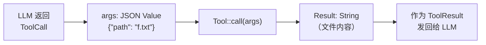

# 第二章：你的第一个工具（Tool）

现在你已经有了一个 mock provider，是时候构建你的第一个工具了。你将实现
`ReadTool` —— 一个读取文件并返回其内容的工具。这是我们 agent 中最简单的工具，
但它引入了所有其他工具都遵循的 `Tool` trait 模式。

## 目标

实现 `ReadTool`，使其满足以下要求：

1. 声明其名称、描述和参数 schema。
2. 当以 `{"path": "some/file.txt"}` 作为参数调用时，读取文件并以字符串形式返回
   其内容。
3. 缺少参数或文件不存在时产生错误。

## 关键 Rust 概念

### `Tool` trait

打开 `mini-claw-code-starter/src/types.rs`，查看 `Tool` trait：

```rust
#[async_trait::async_trait]
pub trait Tool: Send + Sync {
    fn definition(&self) -> &ToolDefinition;
    async fn call(&self, args: Value) -> anyhow::Result<String>;
}
```

两个方法：

- **`definition()`** 返回工具的元数据：名称、描述，以及描述其参数的 JSON Schema。
  LLM 使用这些信息来决定调用哪个工具以及如何格式化参数。
- **`call()`** 实际执行工具。它接收一个包含参数的 `serde_json::Value`，并返回
  一个字符串结果。

### `ToolDefinition`

```rust
pub struct ToolDefinition {
    pub name: &'static str,
    pub description: &'static str,
    pub parameters: Value,
}
```

正如你在第一章中看到的，`ToolDefinition` 有一个用于声明参数的 builder API。对于
ReadTool，我们需要一个名为 `"path"`、类型为 `"string"` 的必填参数：

```rust
ToolDefinition::new("read", "Read the contents of a file.")
    .param("path", "string", "The file path to read", true)
```

在底层，builder 构造了你在第一章中看到的 JSON Schema。最后一个参数（`true`）
将该参数标记为必填。

### 为什么使用 `#[async_trait]` 而不是普通的 `async fn`？

你可能会好奇，为什么我们使用 `async_trait` 宏而不是直接在 trait 中编写
`async fn`。原因是**trait 对象兼容性（trait object compatibility）**。

稍后在 agent 循环中，我们会将工具存储在一个 `ToolSet` 中 —— 一个基于 HashMap
的集合，通过统一接口存放不同类型的工具。这需要*动态分发（dynamic dispatch）*，
意味着编译器需要在编译时知道返回类型的大小。

trait 中的 `async fn` 会为每个实现生成不同的、大小各异的 `Future` 类型。这会破坏
动态分发。`#[async_trait]` 宏会自动将 `async fn` 改写为返回
`Pin<Box<dyn Future<...>>>` 的方法，无论哪个工具产生它，其大小都是固定已知的。
你只需编写普通的 `async fn` 代码，宏会替你处理装箱（boxing）。

以下是 agent 调用工具时的数据流：



LLM 从不直接接触文件系统。它产生一个 JSON 请求，你的代码执行请求，然后返回
一个字符串。

## 实现

打开 `mini-claw-code-starter/src/tools/read.rs`。结构体、`Default` 实现和方法
签名已经提供好了。

记得在你的 `impl Tool for ReadTool` 块上添加 `#[async_trait::async_trait]` 注解。
starter 文件中已经预置了这个注解。

### 第一步：实现 `new()`

创建一个 `ToolDefinition` 并将其存储在 `self.definition` 中。使用 builder：

```rust
ToolDefinition::new("read", "Read the contents of a file.")
    .param("path", "string", "The file path to read", true)
```

### 第二步：`definition()` —— 已提供

`definition()` 方法已经在 starter 中实现了 —— 它只是简单地返回
`&self.definition`。这里不需要做任何工作。

### 第三步：实现 `call()`

这是真正的工作所在。你的实现应该：

1. 从 `args` 中提取 `"path"` 参数。
2. 异步读取文件。
3. 返回文件内容。

以下是大致结构：

```rust
async fn call(&self, args: Value) -> anyhow::Result<String> {
    // 1. 提取 path
    // 2. 使用 tokio::fs::read_to_string 读取文件
    // 3. 返回内容
}
```

一些有用的 API：

- `args["path"].as_str()` 返回 `Option<&str>`。使用来自 `anyhow` 的
  `.context("missing 'path' argument")?` 将 `None` 转换为描述性错误。
- `tokio::fs::read_to_string(path).await` 异步读取文件。链式调用
  `.with_context(|| format!("failed to read '{path}'"))?` 以获得清晰的错误信息。

就是这样 —— 提取路径，读取文件，返回内容。

## 运行测试

运行第二章的测试：

```bash
cargo test -p mini-claw-code-starter ch2
```

### 测试验证内容

- **`test_ch2_read_definition`**：创建一个 `ReadTool`，检查其名称是 `"read"`、
  描述非空，且 `"path"` 在必填参数中。
- **`test_ch2_read_file`**：创建一个包含已知内容的临时文件，用文件路径调用
  `ReadTool`，检查返回的内容是否匹配。
- **`test_ch2_read_missing_file`**：用一个不存在的路径调用 `ReadTool`，验证它
  返回错误。
- **`test_ch2_read_missing_arg`**：用一个空的 JSON 对象（没有 `"path"` 键）调用
  `ReadTool`，验证它返回错误。

还有一些额外的边界情况测试（空文件、Unicode 内容、错误的参数类型等），一旦你的
核心实现正确，这些测试也会通过。

## 回顾

你通过实现 `Tool` trait 构建了你的第一个工具。关键模式：

- **`ToolDefinition::new(...).param(...)`** 声明工具的名称、描述和参数。
- **`#[async_trait::async_trait]`** 放在 `impl` 块上，让你可以编写
  `async fn call()` 同时保持 trait 对象兼容性。
- **`tokio::fs`** 用于异步文件 I/O。
- **`anyhow::Context`** 用于添加描述性错误信息。

agent 中的每个工具都遵循完全相同的结构。一旦你理解了 `ReadTool`，其余的工具
都是在此基础上的变体。

## 下一步

在[第三章：单轮调用](./ch03-single-turn.md)中，你将编写一个函数，通过匹配
`StopReason` 来处理一轮工具调用。
