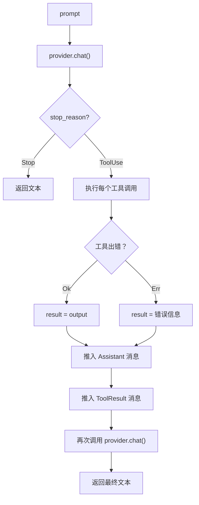
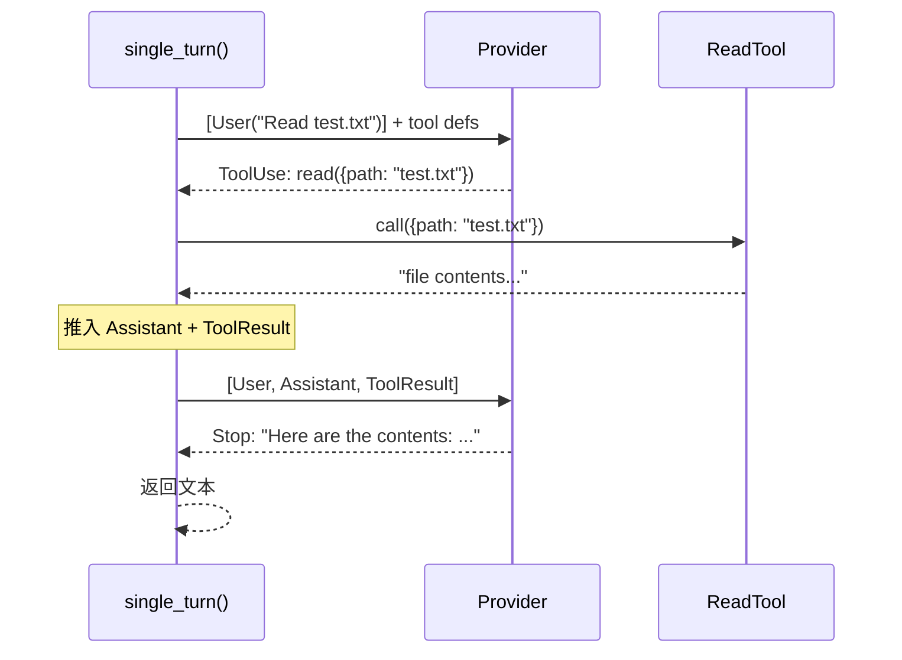
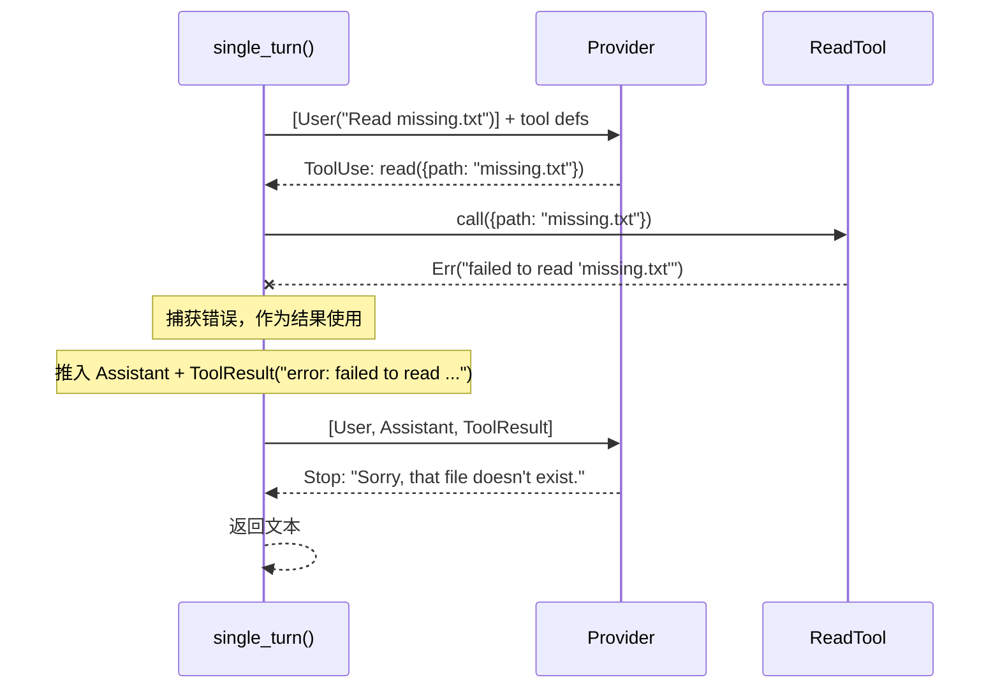

# 第三章：单轮交互（Single Turn）

你已经有了一个 provider 和一个工具。在进入完整的 agent 循环之前，让我们
先看看原始协议：LLM 返回一个 `stop_reason`，告诉你它是已经完成了还是想要
使用工具。在本章中，你将编写一个函数，处理恰好一个提示词（prompt），最多
进行一轮工具调用。

## 目标

实现 `single_turn()`，使其：

1. 将提示词发送给 provider。
2. 对 `stop_reason` 进行模式匹配（match）。
3. 如果是 `Stop` —— 返回文本。
4. 如果是 `ToolUse` —— 执行工具，将结果发回，返回最终文本。

没有循环，只有一轮。

## 关键 Rust 概念

### `ToolSet` —— 一个工具的 HashMap

函数签名接收 `&ToolSet` 而不是原始的切片（slice）或向量（vector）：

```rust
pub async fn single_turn<P: Provider>(
    provider: &P,
    tools: &ToolSet,
    prompt: &str,
) -> anyhow::Result<String>
```

`ToolSet` 包装了一个 `HashMap<String, Box<dyn Tool>>`，并按定义名称索引工具。
这样在执行工具调用时可以实现 O(1) 查找，而不需要遍历列表。构建器 API 会自动
从每个工具的定义中提取名称：

```rust
let tools = ToolSet::new().with(ReadTool::new());
let result = single_turn(&provider, &tools, "Read test.txt").await?;
```

### 对 `StopReason` 进行 `match`

这是核心教学要点。与其检查 `tool_calls.is_empty()`，不如显式地对 stop reason
进行匹配：

```rust
match turn.stop_reason {
    StopReason::Stop => { /* 返回文本 */ }
    StopReason::ToolUse => { /* 执行工具 */ }
}
```

这使得协议变得可见。LLM 告诉你该做什么，而你显式地处理每种情况。

以下是 `single_turn()` 的完整流程：



与完整 agent 循环（第五章）的关键区别在于，这里没有外层循环。如果 LLM 第二次
请求使用工具，`single_turn()` 不会处理 —— 那是 agent 循环的职责。

## 实现

打开 `mini-claw-code-starter/src/agent.rs`。你会看到 `single_turn()` 的函数
签名在文件顶部，位于 `SimpleAgent` 结构体之前。

### 步骤 1：收集工具定义

`ToolSet` 有一个 `definitions()` 方法，返回所有工具的 schema：

```rust
let defs = tools.definitions();
```

### 步骤 2：创建初始消息

```rust
let mut messages = vec![Message::User(prompt.to_string())];
```

### 步骤 3：调用 provider

```rust
let turn = provider.chat(&messages, &defs).await?;
```

### 步骤 4：对 `stop_reason` 进行匹配

这是函数的核心：

```rust
match turn.stop_reason {
    StopReason::Stop => Ok(turn.text.unwrap_or_default()),
    StopReason::ToolUse => {
        // 执行工具，发送结果，获取最终答案
    }
}
```

对于 `ToolUse` 分支：

1. 对于每个工具调用，找到匹配的工具并调用它。**先将结果收集到一个 `Vec` 中**
   —— 你需要 `turn.tool_calls` 来完成这一步，所以还不能移动（move）`turn`。
2. 推入 `Message::Assistant(turn)`，然后为每个结果推入 `Message::ToolResult`。
   推入 assistant 轮次会移动 `turn`，这就是为什么你必须事先收集结果。
3. 再次调用 provider 以获取最终答案。
4. 返回 `final_turn.text.unwrap_or_default()`。

查找和执行工具的逻辑与你在 agent 循环（第五章）中使用的相同：

```rust
println!("{}", tool_summary(call));
let content = match tools.get(&call.name) {
    Some(t) => t.call(call.arguments.clone()).await
        .unwrap_or_else(|e| format!("error: {e}")),
    None => format!("error: unknown tool `{}`", call.name),
};
```

`tool_summary()` 辅助函数会将每个工具调用打印到终端，让你可以看到 agent 正在
使用哪些工具以及传递了什么参数。例如，`[bash: ls -la]` 或
`[read: src/main.rs]`。（参考实现使用 `print!("\x1b[2K\r...")` 而不是
`println!` 来在打印之前清除 `thinking...` 指示行 —— 你将在第七章看到这个
模式。目前使用普通的 `println!` 就可以了。）

### 错误处理 —— 永远不要让循环崩溃

注意工具错误是**被捕获的，而不是被传播的**。`.unwrap_or_else()` 将任何错误
转换为类似 `"error: failed to read 'missing.txt'"` 的字符串。这个字符串作为
普通的工具结果发送回 LLM。然后 LLM 可以决定下一步怎么做 —— 尝试不同的文件、
使用其他工具，或者向用户解释问题。

未知工具也是同样的处理方式 —— 不是 panic，而是将错误消息作为工具结果发送回去。

这是一个关键的设计原则：**agent 循环永远不应该因为工具失败而崩溃**。工具操作的
是真实世界（文件、进程、网络），失败是意料之中的。如果你把错误信息提供给 LLM，
它足够聪明来进行恢复。

以下是成功工具调用的消息序列：



以下是工具失败时的情况（例如文件未找到）：



错误不会使 agent 崩溃。它变成了一个工具结果，由 LLM 读取并做出响应。

## 运行测试

运行第三章的测试：

```bash
cargo test -p mini-claw-code-starter ch3
```

### 测试验证了什么

- **`test_ch3_direct_response`**：Provider 返回 `StopReason::Stop`。
  `single_turn` 应该直接返回文本。
- **`test_ch3_one_tool_call`**：Provider 返回带有 `read` 工具调用的
  `StopReason::ToolUse`，然后返回 `StopReason::Stop`。验证文件已被读取
  并返回最终文本。
- **`test_ch3_unknown_tool`**：Provider 为一个不存在的工具返回
  `StopReason::ToolUse`。验证错误消息作为工具结果发送并返回最终文本。

- **`test_ch3_tool_error_propagates`**：Provider 请求对一个不存在的文件
  进行 `read`。错误应该被捕获并作为工具结果发送回 LLM（而不是使函数崩溃）。
  然后 LLM 用文本进行响应。

还有一些额外的边界情况测试（空响应、一轮中的多个工具调用等），一旦你的核心
实现正确，它们就会通过。

## 回顾

你已经编写了 LLM 协议的最简处理程序：

- **对 `StopReason` 进行匹配** —— 模型告诉你下一步该做什么。
- **没有循环** —— 你最多处理一轮工具调用。
- **`ToolSet`** —— 一个基于 HashMap 的集合，按名称 O(1) 查找工具。

这是基础。在第五章中，你将把同样的逻辑包装在循环中，创建完整的 agent。

## 下一步

在[第四章：更多工具](./ch04-more-tools.md)中，你将实现另外三个工具：
`BashTool`、`WriteTool` 和 `EditTool`。
