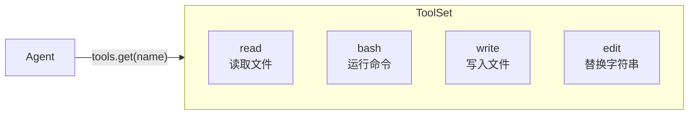
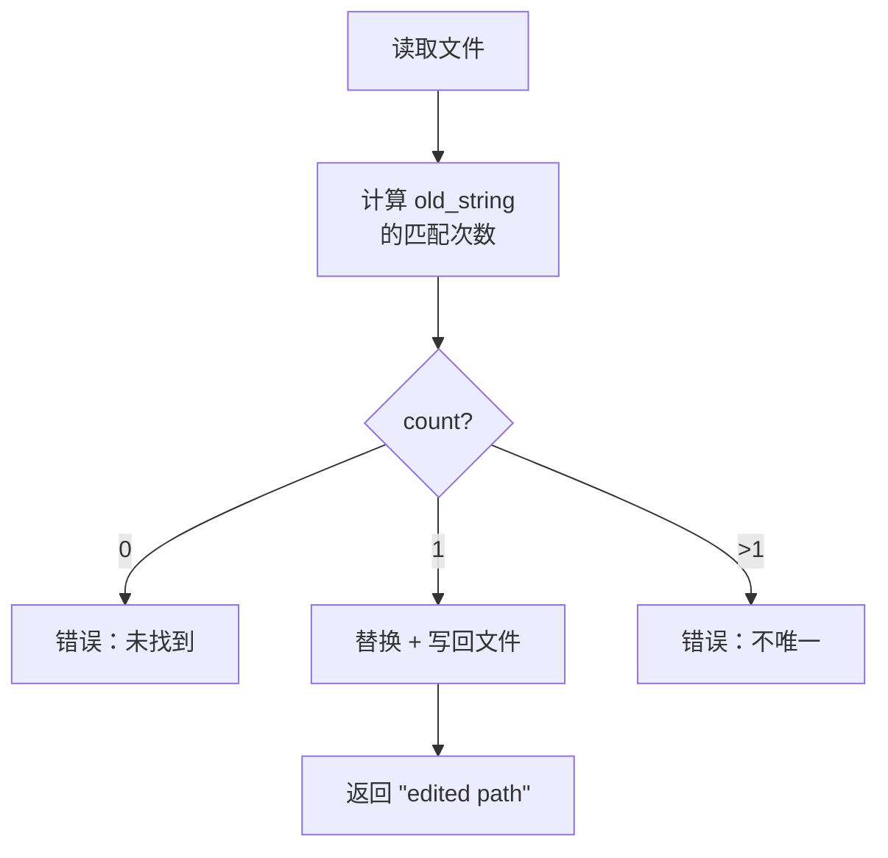

# 第四章：更多工具

你已经实现了 `ReadTool` 并理解了 `Tool` trait 模式。现在你将实现另外三个工具：`BashTool`、`WriteTool` 和 `EditTool`。每个工具都遵循相同的结构——定义 schema、实现 `call()`——因此本章通过重复练习来巩固这一模式。

在本章结束时，你的 agent 将拥有与文件系统交互和执行命令所需的全部四个工具。



## 目标

实现三个工具：

1. **BashTool**——运行 shell 命令并返回其输出。
2. **WriteTool**——将内容写入文件，按需创建目录。
3. **EditTool**——替换文件中的精确字符串（必须恰好出现一次）。

## 关键 Rust 概念

### `tokio::process::Command`

Tokio 提供了对 `std::process::Command` 的异步（async）封装。你将在 `BashTool` 中使用它：

```rust
let output = tokio::process::Command::new("bash")
    .arg("-c")
    .arg(command)
    .output()
    .await?;
```

这会运行 `bash -c "<command>"` 并捕获 stdout 和 stderr。`output` 结构体的 `stdout` 和 `stderr` 字段是 `Vec<u8>` 类型，你可以使用 `String::from_utf8_lossy()` 将它们转换为字符串。

### `bail!()` 宏

`anyhow::bail!()` 宏是立即返回错误的简写形式：

```rust
use anyhow::bail;

if count == 0 {
    bail!("not found");
}
// 等价于：
// return Err(anyhow::anyhow!("not found"));
```

你将在 `EditTool` 中用它来进行验证。

确保导入它：`use anyhow::{Context, bail};`。starter 文件的 `edit.rs` 中已经包含了这个导入。

### `create_dir_all`

当写入文件到类似 `a/b/c/file.txt` 的路径时，父目录可能不存在。`tokio::fs::create_dir_all` 会创建整个目录树：

```rust
if let Some(parent) = std::path::Path::new(path).parent() {
    tokio::fs::create_dir_all(parent).await?;
}
```

---

## 工具 1：BashTool

打开 `mini-claw-code-starter/src/tools/bash.rs`。

### Schema

使用你在第二章学到的构建器模式（builder pattern）：

```rust
ToolDefinition::new("bash", "Run a bash command and return its output.")
    .param("command", "string", "The bash command to run", true)
```

### 实现

`call()` 方法应该：

1. 从 args 中提取 `"command"`。
2. 使用 `tokio::process::Command` 运行 `bash -c <command>`。
3. 捕获 stdout 和 stderr。
4. 构建结果字符串：
   - 以 stdout 开头（如果非空）。
   - 追加以 `"stderr: "` 为前缀的 stderr（如果非空）。
   - 如果两者都为空，返回 `"(no output)"`。

思考一下如何组合 stdout 和 stderr。如果两者都存在，你需要用换行符分隔它们。类似这样：

```rust
let mut result = String::new();
if !stdout.is_empty() {
    result.push_str(&stdout);
}
if !stderr.is_empty() {
    if !result.is_empty() {
        result.push('\n');
    }
    result.push_str("stderr: ");
    result.push_str(&stderr);
}
if result.is_empty() {
    result.push_str("(no output)");
}
```

---

## 工具 2：WriteTool

打开 `mini-claw-code-starter/src/tools/write.rs`。

### Schema

```rust
ToolDefinition::new("write", "Write content to a file, creating directories as needed.")
    .param("path", "string", "The file path to write to", true)
    .param("content", "string", "The content to write to the file", true)
```

### 实现

`call()` 方法应该：

1. 从 args 中提取 `"path"` 和 `"content"`。
2. 如果父目录不存在，则创建它们。
3. 将内容写入文件。
4. 返回确认消息，如 `"wrote {path}"`。

创建父目录的方法：

```rust
if let Some(parent) = std::path::Path::new(path).parent() {
    tokio::fs::create_dir_all(parent).await
        .with_context(|| format!("failed to create directories for '{path}'"))?;
}
```

然后写入文件：

```rust
tokio::fs::write(path, content).await
    .with_context(|| format!("failed to write '{path}'"))?;
```

---

## 工具 3：EditTool

打开 `mini-claw-code-starter/src/tools/edit.rs`。

### Schema

```rust
ToolDefinition::new("edit", "Replace an exact string in a file (must appear exactly once).")
    .param("path", "string", "The file path to edit", true)
    .param("old_string", "string", "The exact string to find and replace", true)
    .param("new_string", "string", "The replacement string", true)
```

### 实现

`call()` 方法是其中最有趣的。它应该：

1. 从 args 中提取 `"path"`、`"old_string"` 和 `"new_string"`。
2. 读取文件内容。
3. 计算 `old_string` 在内容中出现的次数。
4. 如果计数为 0，返回错误：未找到该字符串。
5. 如果计数大于 1，返回错误：该字符串不唯一。
6. 替换唯一的匹配项并将文件写回。
7. 返回确认消息，如 `"edited {path}"`。

验证很重要——要求恰好匹配一次可以防止在错误位置进行意外编辑。



常用 API：

- `content.matches(old).count()` 计算子字符串出现的次数。
- `content.replacen(old, new, 1)` 替换第一次出现的匹配。
- `bail!("old_string not found in '{path}'")`  用于未找到的情况。
- `bail!("old_string appears {count} times in '{path}', must be unique")` 用于不唯一的情况。

---

## 运行测试

运行第四章的测试：

```bash
cargo test -p mini-claw-code-starter ch4
```

### 测试验证内容

**BashTool：**
- **`test_ch4_bash_definition`**：检查名称为 `"bash"` 且 `"command"` 为必填参数。
- **`test_ch4_bash_runs_command`**：运行 `echo hello` 并检查输出包含 `"hello"`。
- **`test_ch4_bash_captures_stderr`**：运行 `echo err >&2` 并检查 stderr 被捕获。
- **`test_ch4_bash_missing_arg`**：传入空 args 并期望返回错误。

**WriteTool：**
- **`test_ch4_write_definition`**：检查名称为 `"write"`。
- **`test_ch4_write_creates_file`**：写入临时文件并读回验证。
- **`test_ch4_write_creates_dirs`**：写入 `a/b/c/out.txt` 并验证目录已创建。
- **`test_ch4_write_missing_arg`**：只传入 `"path"`（无 `"content"`）并期望返回错误。

**EditTool：**
- **`test_ch4_edit_definition`**：检查名称为 `"edit"`。
- **`test_ch4_edit_replaces_string`**：将包含 `"hello world"` 的文件中的 `"hello"` 编辑为 `"goodbye"`，并检查结果为 `"goodbye world"`。
- **`test_ch4_edit_not_found`**：尝试替换不存在的字符串并期望返回错误。
- **`test_ch4_edit_not_unique`**：尝试在包含 `"aaa"`（三次出现）的文件中替换 `"a"` 并期望返回错误。

还有针对每个工具的额外边界情况测试（错误的参数类型、缺少参数、输出格式检查等），这些测试在你的核心实现正确后就会通过。

## 回顾

你现在拥有了四个工具，它们都遵循相同的模式：

1. 使用 `::new(...).param(...)` 构建器调用定义 `ToolDefinition`。
2. 从 `definition()` 返回 `&self.definition`。
3. 在 `impl Tool` 块上添加 `#[async_trait::async_trait]` 并编写 `async fn call()`。

这是有意为之的设计。`Tool` trait 使得每个工具从 agent 的角度来看都是可互换的。agent 不需要知道也不关心工具内部如何工作——它只需要 definition（用于告知 LLM）和 call 方法（用于执行）。

## 下一步

有了 provider 和四个工具，现在是时候将它们连接起来了。在[第五章：你的第一个 Agent SDK！](./ch05-agent-loop.md)中，你将构建 `SimpleAgent`——核心循环，它向 provider 发送提示、执行工具调用，并不断迭代直到 LLM 给出最终答案。
