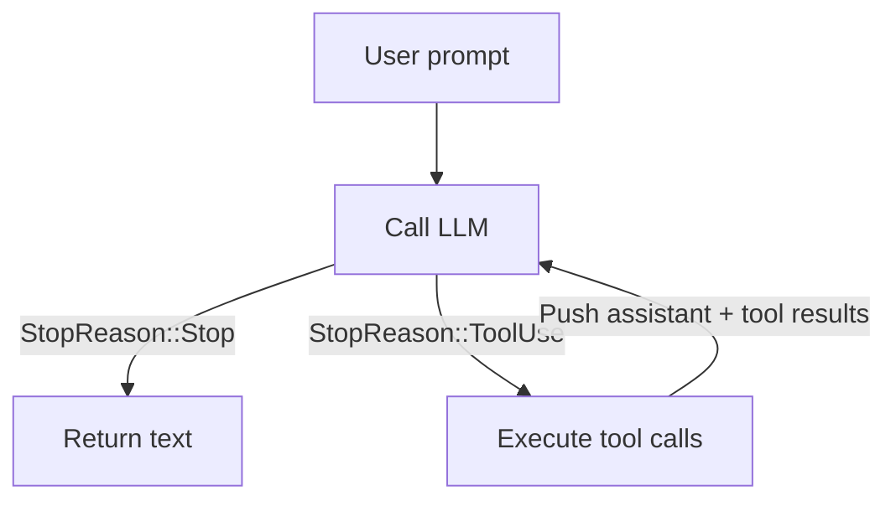

# 第五章：你的第一个 Agent SDK！

这是所有内容汇聚在一起的章节。你已经有了一个返回 `AssistantTurn` 响应的
Provider，以及四个可以执行操作的工具。现在你要构建 `SimpleAgent` ——将它们
连接起来的循环。

这是本教程的"顿悟"时刻。Agent 循环（Agent Loop）短得出人意料，但正是它将
LLM 变成了一个真正的 Agent。

## 什么是 Agent 循环？

在第三章中，你实现了 `single_turn()` ——一次提示、一轮工具调用、一个最终答案。
当 LLM 读完单个文件就能获得所有所需信息时，这已经足够了。但现实任务往往更加
复杂：

> "找到这个项目中的 bug 并修复它。"

LLM 可能需要读取五个文件、运行测试套件、编辑源文件、再次运行测试，然后才能
给出报告。每一步都是一次工具调用，而 LLM 无法提前规划好所有调用，因为上一次
调用的结果决定了下一步该做什么。它需要一个**循环**。

Agent 循环就是这个循环：



1. 将消息发送给 LLM。
2. 如果 LLM 表示"我完成了"（`StopReason::Stop`），返回其文本。
3. 如果 LLM 表示"我需要工具"（`StopReason::ToolUse`），执行工具调用。
4. 将助手的回合和工具结果追加到消息历史中。
5. 回到第 1 步。

这就是每一个编程 Agent 的完整架构 ——Claude Code、Cursor、OpenCode、Copilot
都是如此。细节上有所不同（流式输出、并行工具调用、安全检查），但核心循环始终
相同。而你即将用大约 30 行 Rust 代码来构建它。

## 目标

实现 `SimpleAgent`，使其满足：

1. 它持有一个 Provider 和一组工具。
2. 你可以使用构建者模式（Builder Pattern）注册工具（`.tool(ReadTool::new())`）。
3. `run()` 方法实现工具调用循环：提示 -> Provider -> 工具调用 -> 工具结果 ->
   Provider -> ... -> 最终文本。

## 关键 Rust 概念

### 带特征约束的泛型（Generics with Trait Bounds）

```rust
pub struct SimpleAgent<P: Provider> {
    provider: P,
    tools: ToolSet,
}
```

`<P: Provider>` 意味着 `SimpleAgent` 对任何实现了 `Provider` 特征的类型都是
泛型的。当你使用 `MockProvider` 时，编译器会生成专门针对 `MockProvider` 的
代码。当你使用 `OpenRouterProvider` 时，它会为该类型生成代码。逻辑相同，
Provider 不同。

### `ToolSet` ——特征对象的 HashMap

`tools` 字段是一个 `ToolSet`，它内部封装了一个
`HashMap<String, Box<dyn Tool>>`。每个值都是一个堆分配的*特征对象（Trait
Object）*，它实现了 `Tool`，但具体类型可以不同。一个可能是 `ReadTool`，另一个
可能是 `BashTool`。HashMap 的键是工具的名称，在执行工具调用时可以实现 O(1)
查找。

为什么使用特征对象（`Box<dyn Tool>`）而不是泛型？因为你需要一个**异构集合
（Heterogeneous Collection）**。`Vec<T>` 要求所有元素都是相同类型。而
`Box<dyn Tool>` 可以擦除具体类型，将它们全部存储在同一个接口背后。

这也是 `Tool` 特征使用 `#[async_trait]` 的原因——该宏将 `async fn` 重写为
一个带有统一类型的装箱 Future（Boxed Future），使其能在不同的工具实现之间
保持一致。

### 构建者模式（Builder Pattern）

`tool()` 方法按值接收 `self`（而不是 `&mut self`）并返回 `Self`：

```rust
pub fn tool(mut self, t: impl Tool + 'static) -> Self {
    // 将工具加入集合
    self
}
```

这样你就可以链式调用：

```rust
let agent = SimpleAgent::new(provider)
    .tool(BashTool::new())
    .tool(ReadTool::new())
    .tool(WriteTool::new())
    .tool(EditTool::new());
```

`impl Tool + 'static` 参数接受任何实现了 `Tool` 且具有 `'static` 生命周期的
类型（意味着它不借用临时数据）。在方法内部，你将它推入 `ToolSet`，后者会将其
装箱并按名称索引。

## 实现

打开 `mini-claw-code-starter/src/agent.rs`。结构体定义和方法签名已经提供好了。

### 第 1 步：实现 `new()`

存储 Provider 并初始化一个空的 `ToolSet`：

```rust
pub fn new(provider: P) -> Self {
    Self {
        provider,
        tools: ToolSet::new(),
    }
}
```

这一步很简单直接。

### 第 2 步：实现 `tool()`

将工具推入集合，返回 self：

```rust
pub fn tool(mut self, t: impl Tool + 'static) -> Self {
    self.tools.push(t);
    self
}
```

### 第 3 步：实现 `run()` ——核心循环

这是 Agent 的心脏。以下是流程：

1. 从所有已注册的工具中收集工具定义。
2. 创建一个 `messages` 向量，以用户的提示作为起始。
3. 循环：
   a. 调用 `self.provider.chat(&messages, &defs)` 获取一个 `AssistantTurn`。
   b. 对 `turn.stop_reason` 进行匹配：
      - `StopReason::Stop` ——LLM 完成了，返回 `turn.text`。
      - `StopReason::ToolUse` ——对每个工具调用：
        1. 按名称查找匹配的工具。
        2. 用参数调用它。
        3. 收集结果。
   c. 将 `AssistantTurn` 作为 `Message::Assistant` 推入。
   d. 将每个工具结果作为 `Message::ToolResult` 推入。
   e. 继续循环。

仔细思考数据流。执行工具后，你需要同时推入助手的回合（这样 LLM 能看到它请求
了什么）*和*工具结果（这样它能看到发生了什么）。这为 LLM 提供了完整的上下文，
以便决定下一步该做什么。

### 收集工具定义

在 `run()` 的开头，从 `ToolSet` 中收集所有工具定义：

```rust
let defs = self.tools.definitions();
```

### 循环结构

这就是 `single_turn()`（来自第三章）包裹在循环中的版本。不再只处理一轮，而是
在 `loop` 内部对 `stop_reason` 进行 `match`：

```rust
loop {
    let turn = self.provider.chat(&messages, &defs).await?;

    match turn.stop_reason {
        StopReason::Stop => return Ok(turn.text.unwrap_or_default()),
        StopReason::ToolUse => {
            // 执行工具调用，收集结果
            // 推入消息
        }
    }
}
```

### 查找和调用工具

对于每个工具调用，在 `ToolSet` 中按名称查找：

```rust
println!("{}", tool_summary(call));
let content = match self.tools.get(&call.name) {
    Some(t) => t.call(call.arguments.clone()).await
        .unwrap_or_else(|e| format!("error: {e}")),
    None => format!("error: unknown tool `{}`", call.name),
};
```

`tool_summary()` 辅助函数会将每个工具调用打印到终端——每个工具一行，附带其关键
参数，这样你就可以实时观察 Agent 在做什么。例如：`[bash: cat Cargo.toml]` 或
`[write: src/lib.rs]`。

### 错误处理

工具错误通过 `.unwrap_or_else()` 捕获并转换为字符串，然后作为工具结果发送回
LLM。这与第三章中的模式相同，在这里尤为关键，因为 Agent 循环会运行多次迭代。
如果工具错误导致循环崩溃，Agent 会在遇到第一个不存在的文件或失败的命令时就
终止。相反，LLM 会看到错误并能够恢复——尝试不同的路径、调整命令或解释问题。

```text
> What's in README.md?
[read: README.md]          <-- 工具失败（文件未找到）
[read: Cargo.toml]         <-- LLM 恢复，尝试另一个文件
Here is the project info from Cargo.toml...
```

未知工具的处理方式相同——将错误字符串作为工具结果返回，而不是崩溃。

### 推入消息

执行完一个回合的所有工具调用后，推入助手消息和工具结果。你需要先收集结果
（因为 `turn` 会被移动到 `Message::Assistant` 中）：

```rust
let mut results = Vec::new();
for call in &turn.tool_calls {
    // ... 执行并收集 (id, content) 对
}

messages.push(Message::Assistant(turn));
for (id, content) in results {
    messages.push(Message::ToolResult { id, content });
}
```

顺序很重要：先推入助手消息，再推入工具结果。这与 LLM API 期望的格式一致。

## 运行测试

运行第五章的测试：

```bash
cargo test -p mini-claw-code-starter ch5
```

### 测试验证的内容

- **`test_ch5_text_response`**：Provider 立即返回文本（不使用工具）。Agent 应
  返回该文本。
- **`test_ch5_single_tool_call`**：Provider 先请求一个 `read` 工具调用，然后
  返回文本。Agent 应执行工具并返回最终文本。
- **`test_ch5_unknown_tool`**：Provider 请求一个不存在的工具。Agent 应优雅地
  处理（将错误字符串作为工具结果返回）并继续获取最终文本。
- **`test_ch5_multi_step_loop`**：Provider 在两个回合中分别请求 `read`，然后
  返回文本。验证循环能够运行多次迭代。
- **`test_ch5_empty_response`**：Provider 返回 `None` 作为文本且没有工具调用。
  Agent 应返回空字符串。
- **`test_ch5_builder_chain`**：验证 `.tool().tool()` 链式调用能够编译——这是
  对构建者模式的编译时检查。

- **`test_ch5_tool_error_propagates`**：Provider 请求对一个不存在的文件执行
  `read`。错误应被捕获并作为工具结果发送回去。然后 LLM 返回文本。验证循环不会
  因工具失败而崩溃。

还有一些额外的边界情况测试（三步循环、多工具流水线等），一旦你的核心实现正确，
它们也会通过。

## 看它全部运作起来

测试通过后，花点时间欣赏你所构建的成果。仅用 `run()` 中大约 30 行代码，你就
拥有了一个可用的 Agent 循环。以下是当测试运行
`agent.run("Read test.txt")` 时发生的事情：

1. 消息：`[User("Read test.txt")]`
2. Provider 返回：针对 `read` 的工具调用，参数为 `{"path": "test.txt"}`
3. Agent 调用 `ReadTool::call()`，获取文件内容
4. 消息：`[User("Read test.txt"), Assistant(tool_call), ToolResult("file content")]`
5. Provider 返回：文本响应
6. Agent 返回文本

Mock Provider 使整个过程确定性且可测试。但完全相同的循环也适用于真正的 LLM
Provider——你只需将 `MockProvider` 替换为 `OpenRouterProvider`。

## 总结

Agent 循环是框架的核心：

- **泛型**（`<P: Provider>`）使其能与任何 Provider 协同工作。
- **`ToolSet`**（`Box<dyn Tool>` 的 HashMap）通过名称实现 O(1) 的工具查找。
- **构建者模式**使配置过程简洁优雅。
- **错误韧性** ——工具错误被捕获并发送回 LLM，而不是向上传播。循环永远不会因工具失败而崩溃。
- **循环**本身很简单：调用 Provider，匹配 `stop_reason`，执行工具，将结果反馈回去，重复。

## 下一步

你的 Agent 可以工作了，但目前只能使用 Mock Provider。在
[第六章：OpenRouter Provider](./ch06-http-provider.md) 中，你将实现
`OpenRouterProvider`，它通过 HTTP 与真正的 LLM API 通信。这就是将你的 Agent
从测试工具变成真正可用工具的关键。
