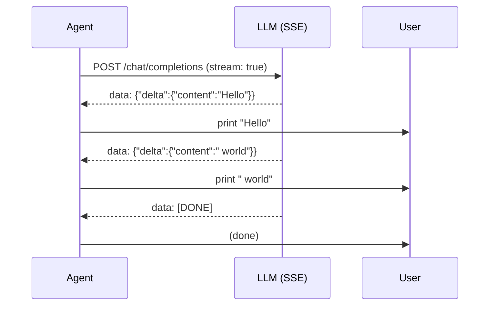
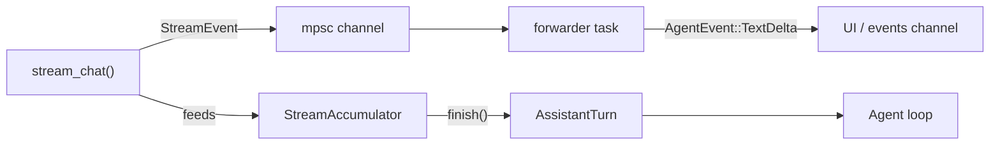

# 第十章：流式输出（Streaming）

在第六章中，你构建了 `OpenRouterProvider::chat()`，它会等待*整个*响应返回后才继续。这样虽然可行，但用户在所有 token 生成完毕之前只能盯着空白屏幕。真正的编码代理（coding agent）会在 token 到达时立即打印出来——这就是流式输出。

本章将添加流式支持，并构建 `StreamingAgent`——`SimpleAgent` 的流式版本。你将：

1. 定义一个 `StreamEvent` 枚举，表示实时增量数据。
2. 构建一个 `StreamAccumulator`，将增量数据收集为完整的 `AssistantTurn`。
3. 编写 `parse_sse_line()` 函数，将原始的服务器推送事件（Server-Sent Events）转换为 `StreamEvent`。
4. 定义 `StreamProvider` trait——`Provider` 的流式版本。
5. 为 `OpenRouterProvider` 实现 `StreamProvider`。
6. 构建用于无 HTTP 测试的 `MockStreamProvider`。
7. 构建 `StreamingAgent<P: StreamProvider>`——一个具有实时文本流的完整代理循环。

这些改动完全不影响 `Provider` trait 和 `SimpleAgent`。流式输出是在现有架构*之上*叠加的功能层。

## 为什么需要流式输出？

没有流式输出时，较长的响应（比如 500 个 token）会让 CLI 看起来像卡住了。流式输出解决了三个问题：

- **即时反馈** —— 用户在几毫秒内就能看到第一个词，而不必等待数秒才看到完整响应。
- **提前取消** —— 如果代理走错方向，用户可以按 Ctrl-C 中断，无需等待完整响应。
- **进度可见** —— 看到 token 逐个到达，可以确认代理正在工作，而非卡住。

## SSE 的工作原理

兼容 OpenAI 的 API 通过
[服务器推送事件（SSE）](https://developer.mozilla.org/en-US/docs/Web/API/Server-sent_events)
支持流式输出。你在请求中设置 `"stream": true`，服务器就不会返回一个大的 JSON 响应，而是发送一系列文本行：

```text
data: {"choices":[{"delta":{"content":"Hello"},"finish_reason":null}]}

data: {"choices":[{"delta":{"content":" world"},"finish_reason":null}]}

data: {"choices":[{"delta":{},"finish_reason":"stop"}]}

data: [DONE]
```

每行以 `data: ` 开头，后跟一个 JSON 对象（或哨兵值 `[DONE]`）。与非流式响应的关键区别在于：每个块不再有包含完整文本的 `message` 字段，而是有一个 `delta` 字段，只包含*新增部分*。你的代码逐个读取这些 delta，立即打印，并将它们累积为最终结果。

流程如下：



工具调用的流式方式相同，只是使用 `tool_calls` delta 而非 `content` delta。工具调用的名称和参数会分片到达，你需要将它们拼接起来。

## StreamEvent

打开 `mini-claw-code/src/streaming.rs`。`StreamEvent` 枚举是我们用于流式增量数据的领域类型：

```rust
#[derive(Debug, Clone, PartialEq)]
pub enum StreamEvent {
    /// 一段助手文本片段。
    TextDelta(String),
    /// 一个新的工具调用已开始。
    ToolCallStart { index: usize, id: String, name: String },
    /// 正在进行的工具调用的更多参数 JSON。
    ToolCallDelta { index: usize, arguments: String },
    /// 流已完成。
    Done,
}
```

这是 SSE 解析器和应用程序其余部分之间的接口。解析器产生 `StreamEvent`；UI 消费它们用于显示；累加器将它们收集为 `AssistantTurn`。

## StreamAccumulator

累加器是一个简单的状态机。它维护一个持续更新的 `text` 缓冲区和一个部分工具调用列表。每次 `feed()` 调用都会追加到适当的位置：

```rust
pub struct StreamAccumulator {
    text: String,
    tool_calls: Vec<PartialToolCall>,
}

impl StreamAccumulator {
    pub fn new() -> Self { /* ... */ }
    pub fn feed(&mut self, event: &StreamEvent) { /* ... */ }
    pub fn finish(self) -> AssistantTurn { /* ... */ }
}
```

实现很直观：

- **`TextDelta`** → 追加到 `self.text`。
- **`ToolCallStart`** → 如果需要，扩展 `tool_calls` 向量，在给定索引处设置 `id` 和 `name`。
- **`ToolCallDelta`** → 在给定索引处追加到参数字符串。
- **`Done`** → 无操作（我们在 `finish()` 中处理完成逻辑）。

`finish()` 消耗累加器并构建一个 `AssistantTurn`：

```rust
pub fn finish(self) -> AssistantTurn {
    let text = if self.text.is_empty() { None } else { Some(self.text) };

    let tool_calls: Vec<ToolCall> = self.tool_calls
        .into_iter()
        .filter(|tc| !tc.name.is_empty())
        .map(|tc| ToolCall {
            id: tc.id,
            name: tc.name,
            arguments: serde_json::from_str(&tc.arguments)
                .unwrap_or(Value::Null),
        })
        .collect();

    let stop_reason = if tool_calls.is_empty() {
        StopReason::Stop
    } else {
        StopReason::ToolUse
    };

    AssistantTurn { text, tool_calls, stop_reason }
}
```

注意 `arguments` 是作为原始字符串累积的，只在最后才解析为 JSON。这是因为 API 会发送类似 `{"pa` 和 `th": "f.txt"}` 这样的参数片段——在拼接之前它们不是有效的 JSON。

## 解析 SSE 行

`parse_sse_line()` 函数接收 SSE 流中的单行，返回零个或多个 `StreamEvent`：

```rust
pub fn parse_sse_line(line: &str) -> Option<Vec<StreamEvent>> {
    let data = line.strip_prefix("data: ")?;

    if data == "[DONE]" {
        return Some(vec![StreamEvent::Done]);
    }

    let chunk: ChunkResponse = serde_json::from_str(data).ok()?;
    // ... 从 chunk.choices[0].delta 中提取事件
}
```

SSE 块类型与 OpenAI 的 delta 格式对应：

```rust
#[derive(Deserialize)]
struct ChunkResponse { choices: Vec<ChunkChoice> }

#[derive(Deserialize)]
struct ChunkChoice { delta: Delta, finish_reason: Option<String> }

#[derive(Deserialize)]
struct Delta {
    content: Option<String>,
    tool_calls: Option<Vec<DeltaToolCall>>,
}
```

对于工具调用，第一个块包含 `id` 和 `function.name`（表示新的工具调用）。后续块只包含 `function.arguments` 片段。解析器在 `id` 存在时发出 `ToolCallStart`，在参数字符串非空时发出 `ToolCallDelta`。

## StreamProvider trait

正如 `Provider` 定义了非流式接口，`StreamProvider` 定义了流式接口：

```rust
pub trait StreamProvider: Send + Sync {
    fn stream_chat<'a>(
        &'a self,
        messages: &'a [Message],
        tools: &'a [&'a ToolDefinition],
        tx: mpsc::UnboundedSender<StreamEvent>,
    ) -> impl Future<Output = anyhow::Result<AssistantTurn>> + Send + 'a;
}
```

与 `Provider::chat()` 的关键区别在于 `tx` 参数——一个 `mpsc` 通道发送端。实现在事件到达时通过该通道发送 `StreamEvent`，*同时*返回最终累积的 `AssistantTurn`。这使调用者既能获取实时事件，又能获取完整结果。

我们将 `StreamProvider` 与 `Provider` 分开，而不是在现有 trait 上添加方法。这意味着 `SimpleAgent` 和所有现有代码完全不受影响。

## 为 OpenRouterProvider 实现 StreamProvider

该实现将 SSE 解析、累加器和通道整合在一起：

```rust
impl StreamProvider for OpenRouterProvider {
    async fn stream_chat(
        &self,
        messages: &[Message],
        tools: &[&ToolDefinition],
        tx: mpsc::UnboundedSender<StreamEvent>,
    ) -> anyhow::Result<AssistantTurn> {
        // 1. 构建带有 stream: true 的请求
        // 2. 发送 HTTP 请求
        // 3. 在循环中读取响应块：
        //    - 缓冲传入的字节
        //    - 按换行符拆分
        //    - 对每个完整行调用 parse_sse_line()
        //    - 将每个事件 feed() 到累加器
        //    - 通过 tx 发送每个事件
        // 4. 返回 acc.finish()
    }
}
```

缓冲细节很重要。HTTP 响应可能以任意字节块到达，不一定与 SSE 行边界对齐。因此我们维护一个 `String` 缓冲区，追加每个块，只处理完整行（按 `\n` 拆分）：

```rust
let mut buffer = String::new();

while let Some(chunk) = resp.chunk().await? {
    buffer.push_str(&String::from_utf8_lossy(&chunk));

    while let Some(newline_pos) = buffer.find('\n') {
        let line = buffer[..newline_pos].trim_end_matches('\r').to_string();
        buffer = buffer[newline_pos + 1..].to_string();

        if line.is_empty() { continue; }

        if let Some(events) = parse_sse_line(&line) {
            for event in events {
                acc.feed(&event);
                let _ = tx.send(event);
            }
        }
    }
}
```

## MockStreamProvider

为了测试，我们需要一个不发起 HTTP 调用的流式 provider。`MockStreamProvider` 包装了现有的 `MockProvider`，并从每个预设的 `AssistantTurn` 合成 `StreamEvent`：

```rust
pub struct MockStreamProvider {
    inner: MockProvider,
}

impl StreamProvider for MockStreamProvider {
    async fn stream_chat(
        &self,
        messages: &[Message],
        tools: &[&ToolDefinition],
        tx: mpsc::UnboundedSender<StreamEvent>,
    ) -> anyhow::Result<AssistantTurn> {
        let turn = self.inner.chat(messages, tools).await?;

        // 从完整的 turn 合成流式事件
        if let Some(ref text) = turn.text {
            for ch in text.chars() {
                let _ = tx.send(StreamEvent::TextDelta(ch.to_string()));
            }
        }
        for (i, call) in turn.tool_calls.iter().enumerate() {
            let _ = tx.send(StreamEvent::ToolCallStart {
                index: i, id: call.id.clone(), name: call.name.clone(),
            });
            let _ = tx.send(StreamEvent::ToolCallDelta {
                index: i, arguments: call.arguments.to_string(),
            });
        }
        let _ = tx.send(StreamEvent::Done);

        Ok(turn)
    }
}
```

它逐字符发送文本（模拟逐 token 的流式输出），并将每个工具调用作为 start + delta 对发送。这让我们可以在没有任何网络调用的情况下测试 `StreamingAgent`。

## StreamingAgent

现在到了重头戏。`StreamingAgent` 是 `SimpleAgent` 的流式版本。它具有相同的结构——一个 provider、一组工具和一个代理循环——但它使用 `StreamProvider` 并实时发出 `AgentEvent::TextDelta` 事件：

```rust
pub struct StreamingAgent<P: StreamProvider> {
    provider: P,
    tools: ToolSet,
}

impl<P: StreamProvider> StreamingAgent<P> {
    pub fn new(provider: P) -> Self { /* ... */ }
    pub fn tool(mut self, t: impl Tool + 'static) -> Self { /* ... */ }

    pub async fn run(
        &self,
        prompt: &str,
        events: mpsc::UnboundedSender<AgentEvent>,
    ) -> anyhow::Result<String> { /* ... */ }

    pub async fn chat(
        &self,
        messages: &mut Vec<Message>,
        events: mpsc::UnboundedSender<AgentEvent>,
    ) -> anyhow::Result<String> { /* ... */ }
}
```

`chat()` 方法是流式代理的核心。让我们逐步解析：

```rust
pub async fn chat(
    &self,
    messages: &mut Vec<Message>,
    events: mpsc::UnboundedSender<AgentEvent>,
) -> anyhow::Result<String> {
    let defs = self.tools.definitions();

    loop {
        // 1. 建立流式通道
        let (stream_tx, mut stream_rx) = mpsc::unbounded_channel();

        // 2. 启动一个转发器，将 StreamEvent::TextDelta
        //    转换为 AgentEvent::TextDelta 发送给 UI
        let events_clone = events.clone();
        let forwarder = tokio::spawn(async move {
            while let Some(event) = stream_rx.recv().await {
                if let StreamEvent::TextDelta(text) = event {
                    let _ = events_clone.send(AgentEvent::TextDelta(text));
                }
            }
        });

        // 3. 调用 stream_chat —— 既进行流式传输，又返回最终结果
        let turn = self.provider.stream_chat(messages, &defs, stream_tx).await?;
        let _ = forwarder.await;

        // 4. 与 SimpleAgent 相同的 stop_reason 逻辑
        match turn.stop_reason {
            StopReason::Stop => {
                let text = turn.text.clone().unwrap_or_default();
                let _ = events.send(AgentEvent::Done(text.clone()));
                messages.push(Message::Assistant(turn));
                return Ok(text);
            }
            StopReason::ToolUse => {
                // 执行工具，推送结果，继续循环
                // （与 SimpleAgent 相同的模式）
            }
        }
    }
}
```

该架构有两个通道同时工作：



转发器任务是一个桥梁：它从 provider 接收原始的 `StreamEvent`，并将 `TextDelta` 事件转换为 `AgentEvent::TextDelta` 发送给 UI。这使得 provider 的流式协议与代理的事件协议保持分离。

注意 `AgentEvent` 现在多了一个 `TextDelta` 变体：

```rust
pub enum AgentEvent {
    TextDelta(String),  // 新增 —— 流式文本片段
    ToolCall { name: String, summary: String },
    Done(String),
    Error(String),
}
```

## 在 TUI 中使用 StreamingAgent

TUI 示例（`examples/tui.rs`）使用 `StreamingAgent` 来提供完整体验：

```rust
let provider = OpenRouterProvider::from_env()?;
let agent = Arc::new(
    StreamingAgent::new(provider)
        .tool(BashTool::new())
        .tool(ReadTool::new())
        .tool(WriteTool::new())
        .tool(EditTool::new()),
);
```

代理被包装在 `Arc` 中，以便与派生的任务共享。每一轮会派生代理并使用加载动画处理事件：

```rust
let (tx, mut rx) = mpsc::unbounded_channel();
let agent = agent.clone();
let mut msgs = std::mem::take(&mut history);
let handle = tokio::spawn(async move {
    let _ = agent.chat(&mut msgs, tx).await;
    msgs
});

// UI 事件循环 —— 打印 TextDelta，为工具调用显示加载动画
loop {
    tokio::select! {
        event = rx.recv() => {
            match event {
                Some(AgentEvent::TextDelta(text)) => print!("{text}"),
                Some(AgentEvent::ToolCall { summary, .. }) => { /* 加载动画 */ },
                Some(AgentEvent::Done(_)) => break,
                // ...
            }
        }
        _ = tick.tick() => { /* 更新加载动画 */ }
    }
}
```

将此与第九章的 `SimpleAgent` 版本对比：结构几乎完全相同。唯一的区别是 `TextDelta` 事件让我们能在 token 到达时立即打印，而不必等待完整的 `Done` 事件。

## 运行测试

```bash
cargo test -p mini-claw-code ch10
```

测试验证了：

- **累加器**：文本组装、工具调用组装、混合事件、空输入、多个并行工具调用。
- **SSE 解析**：文本 delta、工具调用 start/delta、`[DONE]`、非 data 行、空 delta、无效 JSON、完整的多行序列。
- **MockStreamProvider**：文本响应合成逐字符事件；工具调用响应合成 start + delta 事件。
- **StreamingAgent**：纯文本响应、工具调用循环和多轮对话历史——全部使用 `MockStreamProvider` 进行确定性测试。
- **集成测试**：模拟 TCP 服务器发送真实的 SSE 响应给 `stream_chat()`，验证返回的 `AssistantTurn` 和通过通道发送的事件。

## 总结

- **`StreamEvent`** 表示实时增量数据：文本片段、工具调用开始、参数片段和完成信号。
- **`StreamAccumulator`** 将增量数据收集为完整的 `AssistantTurn`。
- **`parse_sse_line()`** 将原始 SSE `data:` 行转换为 `StreamEvent`。
- **`StreamProvider`** 是 `Provider` 的流式版本——它添加了一个 `mpsc` 通道参数用于实时事件。
- **`MockStreamProvider`** 包装 `MockProvider`，为测试合成流式事件。
- **`StreamingAgent`** 是 `SimpleAgent` 的流式版本——相同的工具循环，但带有实时 `TextDelta` 事件转发给 UI。
- `Provider` trait 和 `SimpleAgent` **保持不变**。流式输出是在此之上叠加的增量功能。
