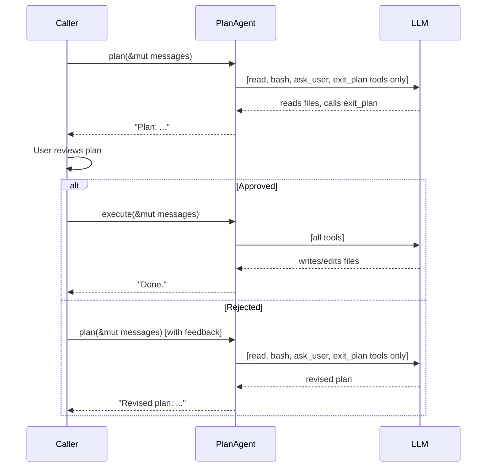

# Chapter 12: Plan Mode

Real coding agents can be dangerous. Give an LLM access to `write`, `edit`,
and `bash` and it might rewrite your config, delete a file, or run a
destructive command -- all before you've had a chance to review what it's doing.

**Plan mode** solves this with a two-phase workflow:

1. **Plan** -- the agent explores the codebase using read-only tools (`read`,
   `bash`, and `ask_user`). It cannot write, edit, or mutate anything. It
   returns a plan describing what it intends to do.
2. **Execute** -- after the user reviews and approves the plan, the agent runs
   again with all tools available.

This is exactly how Claude Code's plan mode works. In this chapter you'll build
`PlanAgent` -- a streaming agent with caller-driven approval gating.

You will:

1. Build `PlanAgent<P: StreamProvider>` with `plan()` and `execute()` methods.
2. Inject a **system prompt** that tells the LLM it's in planning mode.
3. Add an **`exit_plan` tool** the LLM calls when its plan is ready.
4. Implement **double defense**: definition filtering *and* an execution guard.
5. Let the caller drive the approval flow between phases.

## Why plan mode?

Consider this scenario:

```text
User: "Refactor auth.rs to use JWT instead of session cookies"

Agent (no plan mode):
  → calls write("auth.rs", ...) immediately
  → rewrites half your auth system
  → you didn't want that approach at all
```

With plan mode:

```text
User: "Refactor auth.rs to use JWT instead of session cookies"

Agent (plan phase):
  → calls read("auth.rs") to understand current code
  → calls bash("grep -r 'session' src/") to find related files
  → calls exit_plan to submit its plan
  → "Plan: Replace SessionStore with JwtProvider in 3 files..."

User: "Looks good, go ahead."

Agent (execute phase):
  → calls write/edit with the approved changes
```

The key insight: **the same agent loop works for both phases**. The only
difference is *which tools are available*.

## Design

`PlanAgent` has the same shape as `StreamingAgent` -- a provider, a `ToolSet`,
and an agent loop. Three additions make it a planning agent:

1. A `HashSet<&'static str>` recording which tools are allowed during planning.
2. A **system prompt** injected at the start of the planning phase.
3. An **`exit_plan` tool definition** the LLM calls when its plan is ready.

```rust
pub struct PlanAgent<P: StreamProvider> {
    provider: P,
    tools: ToolSet,
    read_only: HashSet<&'static str>,
    plan_system_prompt: String,
    exit_plan_def: ToolDefinition,
}
```

Two public methods drive the two phases:

- **`plan()`** -- injects the system prompt, runs the agent loop with only
  read-only tools and `exit_plan` visible.
- **`execute()`** -- runs the agent loop with all tools visible.

Both delegate to a private `run_loop()` that takes an optional tool filter.

## The builder

Construction follows the same builder pattern as `SimpleAgent` and
`StreamingAgent`:

```rust
impl<P: StreamProvider> PlanAgent<P> {
    pub fn new(provider: P) -> Self {
        Self {
            provider,
            tools: ToolSet::new(),
            read_only: HashSet::from(["bash", "read", "ask_user"]),
            plan_system_prompt: DEFAULT_PLAN_PROMPT.to_string(),
            exit_plan_def: ToolDefinition::new(
                "exit_plan",
                "Signal that your plan is complete and ready for user review. \
                 Call this when you have finished exploring and are ready to \
                 present your plan.",
            ),
        }
    }

    pub fn tool(mut self, t: impl Tool + 'static) -> Self {
        self.tools.push(t);
        self
    }

    pub fn read_only(mut self, names: &[&'static str]) -> Self {
        self.read_only = names.iter().copied().collect();
        self
    }

    pub fn plan_prompt(mut self, prompt: impl Into<String>) -> Self {
        self.plan_system_prompt = prompt.into();
        self
    }
}
```

By default, `bash`, `read`, and `ask_user` are read-only. (Chapter 11 added
`ask_user` so the LLM can ask clarifying questions during planning.) The
`.read_only()` method lets callers override this -- for example, to exclude
`bash` from planning if you want a stricter mode.

The `.plan_prompt()` method lets callers override the system prompt -- useful
for specialized agents like security auditors or code reviewers.

## System prompt

The LLM needs to *know* it's in planning mode. Without this, it will try to
accomplish the task with whatever tools it sees, rather than producing a
deliberate plan.

`plan()` injects a system prompt at the start of the conversation:

```rust
const DEFAULT_PLAN_PROMPT: &str = "\
You are in PLANNING MODE. Explore the codebase using the available tools and \
create a plan. You can read files, run shell commands, and ask the user \
questions — but you CANNOT write, edit, or create files.\n\n\
When your plan is ready, call the `exit_plan` tool to submit it for review.";
```

The injection is conditional -- if the caller already provided a `System`
message, `plan()` respects it:

```rust
pub async fn plan(
    &self,
    messages: &mut Vec<Message>,
    events: mpsc::UnboundedSender<AgentEvent>,
) -> anyhow::Result<String> {
    if !messages
        .first()
        .is_some_and(|m| matches!(m, Message::System(_)))
    {
        messages.insert(0, Message::System(self.plan_system_prompt.clone()));
    }
    self.run_loop(messages, Some(&self.read_only), events).await
}
```

This means:
- **First call**: no system message → inject the plan prompt.
- **Re-plan call**: system message already there → skip.
- **Caller provided their own**: caller's system message → respect it.

This is how real agents work. Claude Code switches its system prompt when
entering plan mode. OpenCode uses entirely separate agent configurations with
different system prompts for `plan` vs `build` agents.

## The `exit_plan` tool

Without `exit_plan`, the planning phase ends when the LLM returns
`StopReason::Stop` -- the same way any conversation ends. This is ambiguous:
did the LLM finish planning, or did it just stop talking?

Real agents solve this with an explicit signal. Claude Code has `ExitPlanMode`.
OpenCode has `exit_plan`. The LLM calls the tool to say "my plan is ready for
review."

In `PlanAgent`, `exit_plan` is a tool definition stored on the struct -- not
registered in the `ToolSet`. This means:

- During **plan**: `exit_plan` is injected into the tool list alongside
  read-only tools. The LLM can see and call it.
- During **execute**: `exit_plan` is not in the tool list. The LLM doesn't
  know it exists.

When the agent loop sees an `exit_plan` call, it returns immediately with the
plan text (the LLM's text from that turn):

```rust
// Handle exit_plan: signal plan completion
if allowed.is_some() && call.name == "exit_plan" {
    results.push((call.id.clone(), "Plan submitted for review.".into()));
    exit_plan = true;
    continue;
}
```

After the tool-call loop, `plan_text` captures the LLM's text from this turn
(the plan itself), and the turn is pushed onto the message history:

```rust
let plan_text = turn.text.clone().unwrap_or_default();
messages.push(Message::Assistant(turn));
```

If `exit_plan` was among the tool calls, we're done:

```rust
if exit_plan {
    let _ = events.send(AgentEvent::Done(plan_text.clone()));
    return Ok(plan_text);
}
```

The planning phase now has two exit paths:
1. **`StopReason::Stop`** -- LLM stops naturally (backward compatible).
2. **`exit_plan` tool call** -- LLM explicitly signals plan completion.

Both work. The `exit_plan` path is better because it's unambiguous.

## Double defense

Tool filtering still uses two layers of protection:

### Layer 1: Definition filtering

During `plan()`, only read-only tool definitions plus `exit_plan` are sent to
the LLM. The model literally cannot see `write` or `edit` in its tool list:

```rust
let all_defs = self.tools.definitions();
let defs: Vec<&ToolDefinition> = match allowed {
    Some(names) => {
        let mut filtered: Vec<&ToolDefinition> = all_defs
            .into_iter()
            .filter(|d| names.contains(d.name))
            .collect();
        filtered.push(&self.exit_plan_def);
        filtered
    }
    None => all_defs,
};
```

During `execute()`, `allowed` is `None`, so all registered tools are sent --
and `exit_plan` is *not* included.

### Layer 2: Execution guard

If the LLM somehow hallucinated a blocked tool call, the execution guard
catches it and returns an error `ToolResult` instead of executing the tool:

```rust
if let Some(names) = allowed
    && !names.contains(call.name.as_str())
{
    results.push((
        call.id.clone(),
        format!(
            "error: tool '{}' is not available in planning mode",
            call.name
        ),
    ));
    continue;
}
```

The error goes back to the LLM as a tool result, so it learns the tool is
blocked and adjusts its behavior. The file is never touched.

## The shared agent loop

Both `plan()` and `execute()` delegate to `run_loop()`. The only parameter
that differs is `allowed`:

```rust
pub async fn plan(
    &self,
    messages: &mut Vec<Message>,
    events: mpsc::UnboundedSender<AgentEvent>,
) -> anyhow::Result<String> {
    // System prompt injection (shown earlier)
    self.run_loop(messages, Some(&self.read_only), events).await
}

pub async fn execute(
    &self,
    messages: &mut Vec<Message>,
    events: mpsc::UnboundedSender<AgentEvent>,
) -> anyhow::Result<String> {
    self.run_loop(messages, None, events).await
}
```

`plan()` passes `Some(&self.read_only)` to restrict tools. `execute()` passes
`None` to allow everything.

The `run_loop` itself is identical to `StreamingAgent::chat()` from Chapter 10,
with these additions:

1. Tool definition filtering (read-only + `exit_plan` during plan; all during
   execute).
2. The `exit_plan` handler that breaks the loop when the LLM signals plan
   completion.
3. The execution guard for blocked tools.

## Caller-driven approval flow

The approval flow lives entirely in the caller. `PlanAgent` does not ask for
approval -- it just runs whichever phase is called. This keeps the agent
simple and lets the caller implement any approval UX they want.

Here is the typical flow:

```rust
let agent = PlanAgent::new(provider)
    .tool(ReadTool::new())
    .tool(WriteTool::new())
    .tool(EditTool::new())
    .tool(BashTool::new());

let mut messages = vec![Message::User("Refactor auth.rs".into())];

// Phase 1: Plan (read-only tools + exit_plan)
let (tx, _rx) = mpsc::unbounded_channel(); // consume _rx to handle streaming events
let plan = agent.plan(&mut messages, tx).await?;
println!("Plan: {plan}");

// Show plan to user, get approval
if user_approves() {
    // Phase 2: Execute (all tools)
    messages.push(Message::User("Approved. Execute the plan.".into()));
    let (tx2, _rx2) = mpsc::unbounded_channel();
    let result = agent.execute(&mut messages, tx2).await?;
    println!("Result: {result}");
} else {
    // Re-plan with feedback
    messages.push(Message::User("No, try a different approach.".into()));
    let (tx3, _rx3) = mpsc::unbounded_channel();
    let revised_plan = agent.plan(&mut messages, tx3).await?;
    println!("Revised plan: {revised_plan}");
}
```

Notice how the same `messages` vec is shared across phases. This is critical --
the LLM sees its own plan, the user's approval (or rejection), and all
previous context when it enters the execute phase. Re-planning is just
pushing feedback as a `User` message and calling `plan()` again.



## Wiring it up

Add the module to `mini-claw-code/src/lib.rs`:

```rust
pub mod planning;
// ...
pub use planning::PlanAgent;
```

That's it. Like streaming, plan mode is a purely additive feature -- no
existing code is modified.

## Running the tests

```bash
cargo test -p mini-claw-code ch12
```

The tests verify:

- **Text response**: `plan()` returns text when the LLM stops immediately.
- **Read tool allowed**: `read` executes during planning.
- **Write tool blocked**: `write` is blocked during planning; the file is NOT
  created; an error `ToolResult` is sent back to the LLM.
- **Edit tool blocked**: same behavior for `edit`.
- **Execute allows write**: `write` works during execution; the file IS created.
- **Full plan-then-execute**: end-to-end flow -- plan reads a file, approval,
  execute writes a file.
- **Message continuity**: messages from the plan phase carry into the execute
  phase, including the injected system prompt.
- **read_only override**: `.read_only(&["read"])` excludes `bash` from
  planning.
- **Streaming events**: `TextDelta` and `Done` events are emitted during
  planning.
- **Provider error**: empty mock propagates errors correctly.
- **Builder pattern**: chained `.tool().read_only().plan_prompt()` compiles.
- **System prompt injection**: `plan()` injects a system prompt at position 0.
- **System prompt not duplicated**: calling `plan()` twice doesn't add a
  second system message.
- **Caller system prompt respected**: if the caller provides a `System`
  message, `plan()` doesn't overwrite it.
- **`exit_plan` tool**: the LLM calls `exit_plan` to signal plan completion;
  `plan()` returns the plan text.
- **`exit_plan` not in execute**: during `execute()`, `exit_plan` is not in
  the tool list.
- **Custom plan prompt**: `.plan_prompt(...)` overrides the default.
- **Full flow with `exit_plan`**: plan reads file → calls `exit_plan` →
  approve → execute writes file.

## Recap

- **`PlanAgent`** separates planning (read-only) from execution (all tools)
  using a single shared agent loop.
- **System prompt**: `plan()` injects a system message telling the LLM it's in
  planning mode — what tools are available, what's blocked, and that it should
  call `exit_plan` when done.
- **`exit_plan` tool**: the LLM explicitly signals plan completion, just like
  Claude Code's `ExitPlanMode`. This is injected during planning and invisible
  during execution.
- **Double defense**: definition filtering prevents the LLM from seeing blocked
  tools; an execution guard catches hallucinated calls.
- **Caller-driven approval**: the agent doesn't manage approval -- the caller
  pushes approval/rejection as `User` messages and calls the appropriate phase.
- **Message continuity**: the same `messages` vec flows through both phases,
  giving the LLM full context.
- **Streaming**: both phases use `StreamProvider` and emit `AgentEvent`s, just
  like `StreamingAgent`.
- **Purely additive**: no changes to `SimpleAgent`, `StreamingAgent`, or any
  existing code.
