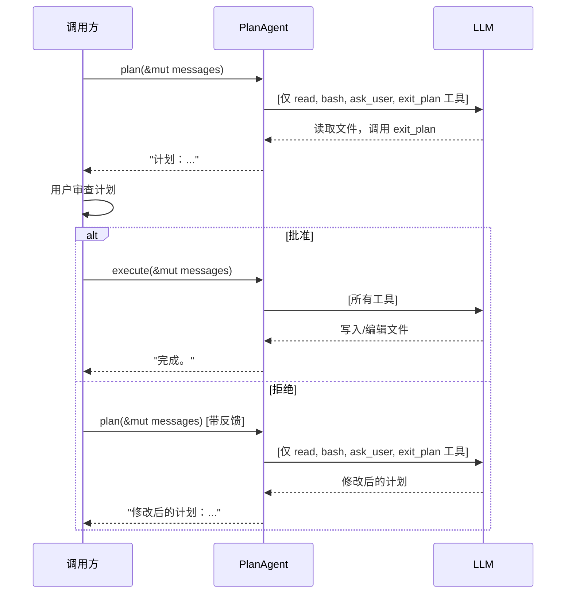

# 第十二章：计划模式

真正的编程智能体可能是危险的。给 LLM 提供 `write`、`edit` 和 `bash` 工具，它可能会改写你的配置、删除文件，或者执行破坏性命令——而这一切都发生在你来得及审查之前。

**计划模式（Plan Mode）** 通过两阶段工作流解决这个问题：

1. **计划阶段** —— 智能体使用只读工具（`read`、`bash` 和 `ask_user`）探索代码库。它不能写入、编辑或修改任何内容。它返回一个描述其意图的计划。
2. **执行阶段** —— 用户审查并批准计划后，智能体再次运行，此时所有工具都可用。

这正是 Claude Code 的计划模式的工作方式。在本章中，你将构建 `PlanAgent` —— 一个带有调用方驱动的批准门控的流式智能体。

你将完成以下任务：

1. 构建带有 `plan()` 和 `execute()` 方法的 `PlanAgent<P: StreamProvider>`。
2. 注入一个**系统提示词（System Prompt）**，告诉 LLM 它处于计划模式。
3. 添加一个 **`exit_plan` 工具**，LLM 在计划就绪时调用它。
4. 实现**双重防御**：定义过滤 *加上* 执行守卫。
5. 让调用方驱动两个阶段之间的批准流程。

## 为什么需要计划模式？

考虑以下场景：

```text
User: "Refactor auth.rs to use JWT instead of session cookies"

Agent (no plan mode):
  → calls write("auth.rs", ...) immediately
  → rewrites half your auth system
  → you didn't want that approach at all
```

使用计划模式：

```text
User: "Refactor auth.rs to use JWT instead of session cookies"

Agent (plan phase):
  → calls read("auth.rs") to understand current code
  → calls bash("grep -r 'session' src/") to find related files
  → calls exit_plan to submit its plan
  → "Plan: Replace SessionStore with JwtProvider in 3 files..."

User: "Looks good, go ahead."

Agent (execute phase):
  → calls write/edit with the approved changes
```

关键洞察：**同一个智能体循环适用于两个阶段**。唯一的区别是*哪些工具可用*。

## 设计

`PlanAgent` 与 `StreamingAgent` 具有相同的结构 —— 一个提供者（Provider）、一个 `ToolSet` 和一个智能体循环。三个新增部分使其成为计划智能体：

1. 一个 `HashSet<&'static str>`，记录在计划阶段允许使用的工具。
2. 一个**系统提示词**，在计划阶段开始时注入。
3. 一个 **`exit_plan` 工具定义**，LLM 在计划就绪时调用。

```rust
pub struct PlanAgent<P: StreamProvider> {
    provider: P,
    tools: ToolSet,
    read_only: HashSet<&'static str>,
    plan_system_prompt: String,
    exit_plan_def: ToolDefinition,
}
```

两个公开方法驱动两个阶段：

- **`plan()`** —— 注入系统提示词，仅使用只读工具和 `exit_plan` 运行智能体循环。
- **`execute()`** —— 使用所有工具运行智能体循环。

两者都委托给一个私有的 `run_loop()`，该方法接受一个可选的工具过滤器。

## 构建器

构造过程遵循与 `SimpleAgent` 和 `StreamingAgent` 相同的构建器模式（Builder Pattern）：

```rust
impl<P: StreamProvider> PlanAgent<P> {
    pub fn new(provider: P) -> Self {
        Self {
            provider,
            tools: ToolSet::new(),
            read_only: HashSet::from(["bash", "read", "ask_user"]),
            plan_system_prompt: DEFAULT_PLAN_PROMPT.to_string(),
            exit_plan_def: ToolDefinition::new(
                "exit_plan",
                "Signal that your plan is complete and ready for user review. \
                 Call this when you have finished exploring and are ready to \
                 present your plan.",
            ),
        }
    }

    pub fn tool(mut self, t: impl Tool + 'static) -> Self {
        self.tools.push(t);
        self
    }

    pub fn read_only(mut self, names: &[&'static str]) -> Self {
        self.read_only = names.iter().copied().collect();
        self
    }

    pub fn plan_prompt(mut self, prompt: impl Into<String>) -> Self {
        self.plan_system_prompt = prompt.into();
        self
    }
}
```

默认情况下，`bash`、`read` 和 `ask_user` 是只读的。（第十一章添加了 `ask_user`，使 LLM 可以在计划阶段提出澄清性问题。）`.read_only()` 方法允许调用方覆盖此设置——例如，如果你想要更严格的模式，可以在计划阶段排除 `bash`。

`.plan_prompt()` 方法允许调用方覆盖系统提示词——这对于安全审计或代码审查等专用智能体很有用。

## 系统提示词

LLM 需要*知道*它处于计划模式。否则，它会尝试用它看到的任何工具来完成任务，而不是产出一个深思熟虑的计划。

`plan()` 在对话开始时注入一个系统提示词：

```rust
const DEFAULT_PLAN_PROMPT: &str = "\
You are in PLANNING MODE. Explore the codebase using the available tools and \
create a plan. You can read files, run shell commands, and ask the user \
questions — but you CANNOT write, edit, or create files.\n\n\
When your plan is ready, call the `exit_plan` tool to submit it for review.";
```

注入是有条件的——如果调用方已经提供了 `System` 消息，`plan()` 会尊重它：

```rust
pub async fn plan(
    &self,
    messages: &mut Vec<Message>,
    events: mpsc::UnboundedSender<AgentEvent>,
) -> anyhow::Result<String> {
    if !messages
        .first()
        .is_some_and(|m| matches!(m, Message::System(_)))
    {
        messages.insert(0, Message::System(self.plan_system_prompt.clone()));
    }
    self.run_loop(messages, Some(&self.read_only), events).await
}
```

这意味着：
- **首次调用**：没有系统消息 → 注入计划提示词。
- **重新计划**：系统消息已存在 → 跳过。
- **调用方提供了自己的**：调用方的系统消息 → 予以保留。

这就是真实智能体的工作方式。Claude Code 在进入计划模式时会切换其系统提示词。OpenCode 使用完全独立的智能体配置，为 `plan` 和 `build` 智能体设置不同的系统提示词。

## `exit_plan` 工具

如果没有 `exit_plan`，计划阶段会在 LLM 返回 `StopReason::Stop` 时结束——与任何对话的结束方式相同。这是模糊的：LLM 是完成了计划，还是只是停止了对话？

真实的智能体通过显式信号来解决这个问题。Claude Code 有 `ExitPlanMode`。OpenCode 有 `exit_plan`。LLM 调用该工具来表示"我的计划已准备好供审查"。

在 `PlanAgent` 中，`exit_plan` 是一个存储在结构体上的工具定义——并未注册到 `ToolSet` 中。这意味着：

- 在**计划阶段**：`exit_plan` 与只读工具一起被注入到工具列表中。LLM 可以看到并调用它。
- 在**执行阶段**：`exit_plan` 不在工具列表中。LLM 不知道它的存在。

当智能体循环看到 `exit_plan` 调用时，它立即返回计划文本（LLM 在该轮次的文本）：

```rust
// 处理 exit_plan：标记计划完成
if allowed.is_some() && call.name == "exit_plan" {
    results.push((call.id.clone(), "Plan submitted for review.".into()));
    exit_plan = true;
    continue;
}
```

在工具调用循环之后，`plan_text` 捕获 LLM 在本轮次的文本（即计划本身），并将该轮次推入消息历史：

```rust
let plan_text = turn.text.clone().unwrap_or_default();
messages.push(Message::Assistant(turn));
```

如果 `exit_plan` 在工具调用中被调用，则流程结束：

```rust
if exit_plan {
    let _ = events.send(AgentEvent::Done(plan_text.clone()));
    return Ok(plan_text);
}
```

计划阶段现在有两条退出路径：
1. **`StopReason::Stop`** —— LLM 自然停止（向后兼容）。
2. **`exit_plan` 工具调用** —— LLM 显式发出计划完成信号。

两者都有效。`exit_plan` 路径更好，因为它是明确的。

## 双重防御

工具过滤仍然使用两层保护：

### 第一层：定义过滤

在 `plan()` 期间，只有只读工具定义加上 `exit_plan` 被发送给 LLM。模型在其工具列表中完全看不到 `write` 或 `edit`：

```rust
let all_defs = self.tools.definitions();
let defs: Vec<&ToolDefinition> = match allowed {
    Some(names) => {
        let mut filtered: Vec<&ToolDefinition> = all_defs
            .into_iter()
            .filter(|d| names.contains(d.name))
            .collect();
        filtered.push(&self.exit_plan_def);
        filtered
    }
    None => all_defs,
};
```

在 `execute()` 期间，`allowed` 为 `None`，因此所有已注册的工具都会被发送——而 `exit_plan` *不会*被包含。

### 第二层：执行守卫

如果 LLM 以某种方式"幻觉"出一个被阻止的工具调用，执行守卫会捕获它并返回错误 `ToolResult`，而不是执行该工具：

```rust
if let Some(names) = allowed
    && !names.contains(call.name.as_str())
{
    results.push((
        call.id.clone(),
        format!(
            "error: tool '{}' is not available in planning mode",
            call.name
        ),
    ));
    continue;
}
```

错误作为工具结果返回给 LLM，这样它就知道该工具被阻止并调整其行为。文件永远不会被触及。

## 共享的智能体循环

`plan()` 和 `execute()` 都委托给 `run_loop()`。唯一不同的参数是 `allowed`：

```rust
pub async fn plan(
    &self,
    messages: &mut Vec<Message>,
    events: mpsc::UnboundedSender<AgentEvent>,
) -> anyhow::Result<String> {
    // 系统提示词注入（前面已展示）
    self.run_loop(messages, Some(&self.read_only), events).await
}

pub async fn execute(
    &self,
    messages: &mut Vec<Message>,
    events: mpsc::UnboundedSender<AgentEvent>,
) -> anyhow::Result<String> {
    self.run_loop(messages, None, events).await
}
```

`plan()` 传入 `Some(&self.read_only)` 来限制工具。`execute()` 传入 `None` 来允许所有工具。

`run_loop` 本身与第十章中 `StreamingAgent::chat()` 完全相同，增加了以下内容：

1. 工具定义过滤（计划阶段：只读工具 + `exit_plan`；执行阶段：全部工具）。
2. `exit_plan` 处理器，当 LLM 发出计划完成信号时中断循环。
3. 被阻止工具的执行守卫。

## 调用方驱动的批准流程

批准流程完全在调用方中实现。`PlanAgent` 不会请求批准——它只执行被调用的阶段。这使智能体保持简单，并允许调用方实现任何他们想要的批准用户体验。

以下是典型流程：

```rust
let agent = PlanAgent::new(provider)
    .tool(ReadTool::new())
    .tool(WriteTool::new())
    .tool(EditTool::new())
    .tool(BashTool::new());

let mut messages = vec![Message::User("Refactor auth.rs".into())];

// 阶段 1：计划（只读工具 + exit_plan）
let (tx, _rx) = mpsc::unbounded_channel(); // 使用 _rx 处理流式事件
let plan = agent.plan(&mut messages, tx).await?;
println!("Plan: {plan}");

// 向用户展示计划，获取批准
if user_approves() {
    // 阶段 2：执行（所有工具）
    messages.push(Message::User("Approved. Execute the plan.".into()));
    let (tx2, _rx2) = mpsc::unbounded_channel();
    let result = agent.execute(&mut messages, tx2).await?;
    println!("Result: {result}");
} else {
    // 带反馈重新计划
    messages.push(Message::User("No, try a different approach.".into()));
    let (tx3, _rx3) = mpsc::unbounded_channel();
    let revised_plan = agent.plan(&mut messages, tx3).await?;
    println!("Revised plan: {revised_plan}");
}
```

请注意同一个 `messages` 向量在各阶段之间共享。这至关重要——当 LLM 进入执行阶段时，它能看到自己的计划、用户的批准（或拒绝）以及所有之前的上下文。重新计划只需将反馈作为 `User` 消息推入并再次调用 `plan()`。



## 接入项目

将模块添加到 `mini-claw-code/src/lib.rs`：

```rust
pub mod planning;
// ...
pub use planning::PlanAgent;
```

就是这样。和流式处理一样，计划模式是一个纯粹的增量功能——不需要修改任何现有代码。

## 运行测试

```bash
cargo test -p mini-claw-code ch12
```

测试验证以下内容：

- **文本响应**：当 LLM 立即停止时，`plan()` 返回文本。
- **读取工具允许**：`read` 在计划阶段可以执行。
- **写入工具阻止**：`write` 在计划阶段被阻止；文件不会被创建；错误 `ToolResult` 被发送回 LLM。
- **编辑工具阻止**：`edit` 同样的行为。
- **执行阶段允许写入**：`write` 在执行阶段正常工作；文件会被创建。
- **完整的计划-执行流程**：端到端流程——计划阶段读取文件，批准后执行阶段写入文件。
- **消息连续性**：计划阶段的消息延续到执行阶段，包括注入的系统提示词。
- **read_only 覆盖**：`.read_only(&["read"])` 将 `bash` 从计划阶段中排除。
- **流式事件**：计划阶段会发出 `TextDelta` 和 `Done` 事件。
- **提供者错误**：空的 Mock 正确传播错误。
- **构建器模式**：链式调用 `.tool().read_only().plan_prompt()` 可编译。
- **系统提示词注入**：`plan()` 在位置 0 注入系统提示词。
- **系统提示词不重复**：调用 `plan()` 两次不会添加第二条系统消息。
- **尊重调用方的系统提示词**：如果调用方提供了 `System` 消息，`plan()` 不会覆盖它。
- **`exit_plan` 工具**：LLM 调用 `exit_plan` 发出计划完成信号；`plan()` 返回计划文本。
- **执行阶段无 `exit_plan`**：在 `execute()` 期间，`exit_plan` 不在工具列表中。
- **自定义计划提示词**：`.plan_prompt(...)` 覆盖默认提示词。
- **带 `exit_plan` 的完整流程**：计划阶段读取文件 → 调用 `exit_plan` → 批准 → 执行阶段写入文件。

## 总结

- **`PlanAgent`** 通过一个共享的智能体循环，将计划（只读）与执行（所有工具）分离。
- **系统提示词**：`plan()` 注入一条系统消息，告诉 LLM 它处于计划模式——哪些工具可用、哪些被阻止，以及它应该在完成时调用 `exit_plan`。
- **`exit_plan` 工具**：LLM 显式发出计划完成信号，就像 Claude Code 的 `ExitPlanMode`。它在计划阶段被注入，在执行阶段不可见。
- **双重防御**：定义过滤阻止 LLM 看到被阻止的工具；执行守卫捕获幻觉产生的调用。
- **调用方驱动的批准**：智能体不管理批准——调用方将批准/拒绝作为 `User` 消息推入并调用相应的阶段。
- **消息连续性**：同一个 `messages` 向量贯穿两个阶段，为 LLM 提供完整的上下文。
- **流式处理**：两个阶段都使用 `StreamProvider` 并发出 `AgentEvent`，与 `StreamingAgent` 一致。
- **纯粹增量**：无需修改 `SimpleAgent`、`StreamingAgent` 或任何现有代码。
