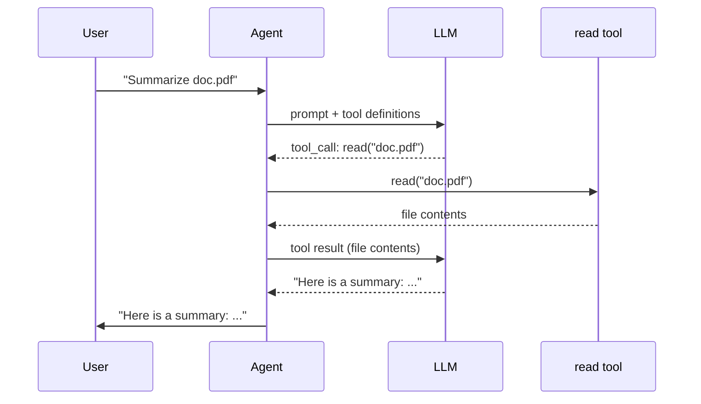
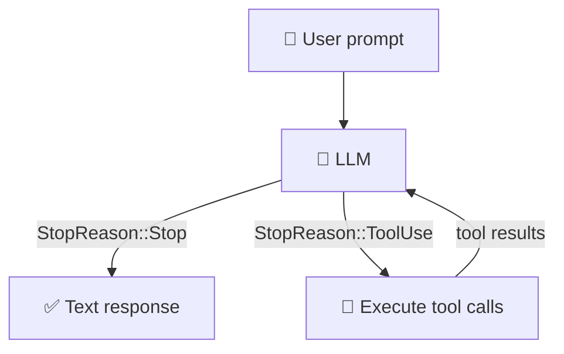

# Overview

Welcome to *Build Your Own Mini Coding Agent in Rust*. Over the next seven chapters you will
implement a mini coding agent from scratch -- a small version of programs like
Claude Code or OpenCode -- a program that takes a prompt, talks to a
large-language model (LLM), and uses *tools* to interact with the real world.

By the end of this book you will have an agent that can run shell commands, read
and write files, and edit code, all driven by an LLM.

## What is an AI agent?

An LLM on its own is a function: text in, text out. Ask it to summarize
`doc.pdf` and it will either refuse or hallucinate -- it has no way to open the
file.

An **agent** solves this by giving the LLM **tools**. A tool is just a function
your code can run -- read a file, execute a shell command, hit an API. The agent
sits in a loop:

1. Send the user's prompt to the LLM.
2. The LLM decides it needs to read `doc.pdf` and outputs a tool call.
3. Your code executes the `read` tool and feeds the file contents back.
4. The LLM now has the text and returns a summary.

The LLM never touches the filesystem. It just *asks*, and your code *does*.
That loop -- ask, execute, feed back -- is the entire idea.

## How does an LLM use a tool?

An LLM cannot execute code. It is a text generator. So "calling a tool" really
means the LLM *outputs a structured request* and your code does the rest.

When you send a request to the LLM, you include a list of **tool definitions**
alongside the conversation. Each definition is a name, a description, and a
JSON schema describing the arguments. For our `read` tool that looks like:

```json
{
  "name": "read",
  "description": "Read the contents of a file.",
  "parameters": {
    "type": "object",
    "properties": {
      "path": { "type": "string" }
    },
    "required": ["path"]
  }
}
```

The LLM reads these definitions the same way it reads the user's prompt -- they
are just part of the input. When it decides it needs to read a file, it does not
run any code. It produces a **structured output** like:

```json
{ "name": "read", "arguments": { "path": "doc.pdf" } }
```

along with a signal that says "I'm not done yet -- I made a tool call." Your
code parses this, runs the real function, and sends the result back as a new
message. The LLM then continues with that result in context.

Here is the full exchange for our "Summarize doc.pdf" example:



The LLM's only job is deciding *which* tool to call and *what arguments* to
pass. Your code does the actual work.

## A minimal agent in pseudocode

Here is that example as code:

```text
tools    = [read_file]
messages = ["Summarize doc.pdf"]

loop:
    response = llm(messages, tools)

    if response.done:
        print(response.text)
        break

    // The LLM wants to call a tool -- run it and feed the result back.
    for call in response.tool_calls:
        result = execute(call.name, call.args)
        messages.append(result)
```

That is the entire agent. The rest of this book is implementing each piece --
the `llm` function, the tools, and the types that connect them -- in Rust.

## The tool-calling loop

Here is the flow of a single agent invocation:



1. The user sends a prompt.
2. The LLM either responds with text (done) or requests one or more tool calls.
3. Your code executes each tool and gathers the results.
4. The results are fed back to the LLM as new messages.
5. Repeat from step 2 until the LLM responds with text.

That is the *entire* architecture. Everything else is implementation detail.

## What we will build

We will build a simple agent framework consisting of:

**4 tools:**

| Tool  | What it does |
|-------|-------------|
| `read`  | Read the contents of a file |
| `write` | Write content to a file (creating directories as needed) |
| `edit`  | Replace an exact string in a file |
| `bash`  | Run a shell command and capture its output |

**1 provider:**

| Provider | Purpose |
|----------|---------|
| `OpenRouterProvider` | Talks to a real LLM over HTTP via the OpenAI-compatible API |

Tests use a `MockProvider` that returns pre-configured responses so you can
run the full test suite without an API key.

## Project structure

The project is a Cargo workspace with three crates and a tutorial book:

```text
mini-code/
  Cargo.toml              # workspace root
  mini-code/             # reference solution (do not peek!)
  mini-code-starter/     # YOUR code -- you implement things here
  mini-code-xtask/             # helper commands (cargo x ...)
  mini-code-book/              # this tutorial
```

- **mini-code** contains the complete, working implementation. It is there so
  the test suite can verify that the exercises are solvable, but you should
  avoid reading it until you have tried on your own.
- **mini-code-starter** is your working crate. Each source file contains
  struct definitions, trait implementations with `unimplemented!()` bodies, and
  doc-comment hints. Your job is to replace the `unimplemented!()` calls with
  real code.
- **mini-code-xtask** provides the `cargo x` helper with `check`,
  `solution-check`, and `book` commands.
- **mini-code-book** is this mdbook tutorial.

## Prerequisites

Before starting, make sure you have:

- **Rust** installed (1.85+ required, for edition 2024). Install from <https://rustup.rs>.
- Basic Rust knowledge: ownership, structs, enums, pattern matching, and
  `Result` / `Option`. If you have read the first half of *The Rust Programming
  Language* book, you are ready.
- A terminal and a text editor.
- **mdbook** (optional, for reading the tutorial locally). Install with
  `cargo install mdbook mdbook-mermaid`.

You do *not* need an API key until Chapter 6. Chapters 1 through 5 use the
`MockProvider` for testing, so everything runs locally.

## Setup

Clone the repository and verify things build:

```bash
git clone https://github.com/odysa/mini-code.git
cd mini-code
cargo build
```

Then verify the test harness works:

```bash
cargo test -p mini-code-starter ch1
```

The tests should fail -- that is expected! Your job in Chapter 1 is to make them
pass.

If `cargo x` does not work, make sure you are in the workspace root (the
directory containing the top-level `Cargo.toml`).

## Chapter roadmap

| Chapter | Topic | What you build |
|---------|-------|----------------|
| 1 | Core Types | `MockProvider` -- understand the core types by building a test helper |
| 2 | Your First Tool | `ReadTool` -- reading files |
| 3 | Single Turn | `single_turn()` -- explicit match on `StopReason`, one round of tool calls |
| 4 | More Tools | `BashTool`, `WriteTool`, `EditTool` |
| 5 | The Agent Loop | `SimpleAgent` -- generalizes `single_turn()` into a loop |
| 6 | The HTTP Provider | `OpenRouterProvider` -- talking to a real LLM API |
| 7 | Putting It Together | A CLI that runs your agent end-to-end |

Each chapter follows the same rhythm:

1. Read the chapter to understand the concepts.
2. Open the corresponding source file in `mini-code-starter/src/`.
3. Replace the `unimplemented!()` calls with your implementation.
4. Run `cargo test -p mini-code-starter chN` to check your work.

Ready? Let's build an agent.

## What's next

Head to [Chapter 1: Core Types](./ch01-core-types.md) to understand the
foundational types -- `StopReason`, `Message`, and the `Provider` trait -- and
build `MockProvider`, the test helper you will use throughout the next four
chapters.
